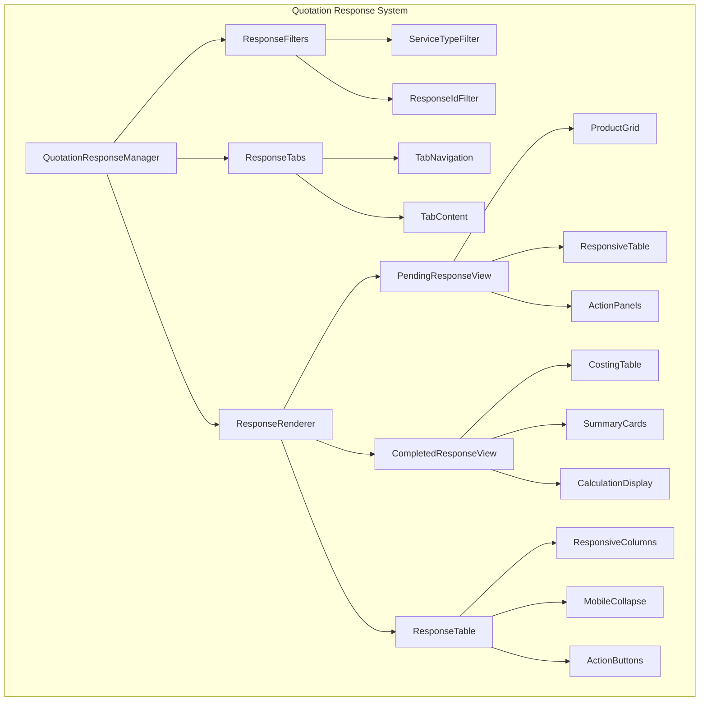
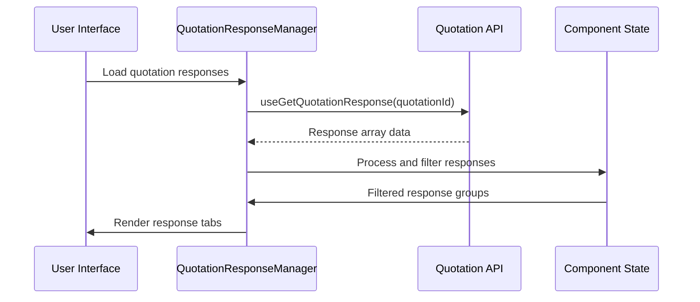

# Component Refactoring Design Document

## Overview

This document outlines the comprehensive refactoring of quotation response components to address critical filtering logic issues, responsive design problems, and code organization improvements. The refactoring focuses on two main components that handle quotation responses display and management.

## Architecture

### Current Issues Analysis

#### 1. Data Filtering Logic Problems
- **Primary Issue**: Response filtering is not properly discriminating between different service types and response IDs
- **Impact**: Only the first response is displayed despite multiple responses being available
- **Root Cause**: Missing unique identification logic combining serviceType + response ID

#### 2. UI Overflow Issues  
- **Primary Issue**: "Pendiente" service type causes layout overflow on mobile devices
- **Impact**: Interface breaks and becomes unreadable on smaller screens
- **Root Cause**: Fixed width tables and non-responsive design patterns

#### 3. Code Organization Issues
- **Primary Issue**: Large monolithic components with mixed responsibilities
- **Impact**: Difficult maintenance and poor reusability
- **Root Cause**: Lack of component decomposition and separation of concerns

### New Component Architecture



## Component Hierarchy

### 1. Main Response Components

#### QuotationResponseManager
- **Purpose**: Main orchestrator component
- **Responsibilities**:
  - Manages global state
  - Handles API data fetching
  - Coordinates child components
  - Error boundary management

#### ResponseDisplayContainer  
- **Purpose**: Display coordination and layout management
- **Responsibilities**:
  - Responsive layout switching
  - Loading states management
  - Error display handling

### 2. Filtering & Navigation Components

#### ResponseFilters
- **Purpose**: Advanced filtering logic implementation
- **Key Features**:
  - Multi-criteria filtering (serviceType + responseId)
  - Real-time filter application
  - Filter state management

#### TabNavigation
- **Purpose**: Dynamic tab generation and management
- **Key Features**:
  - Auto-generation from response data
  - Active state management
  - Responsive tab switching

### 3. Display Components

#### PendingResponseView
- **Purpose**: Specialized view for "Pendiente" responses
- **Key Features**:
  - Mobile-first responsive design
  - Horizontal scroll handling
  - Collapsible sections

#### CompletedResponseView  
- **Purpose**: Display for completed quotation responses
- **Key Features**:
  - Advanced calculations display
  - Cost breakdown tables
  - Summary visualizations

#### ResponsiveProductTable
- **Purpose**: Mobile-optimized product display
- **Key Features**:
  - Automatic column collapsing
  - Touch-friendly interactions
  - Progressive disclosure

## Data Flow Architecture

### 1. API Integration Layer



### 2. Response Processing Logic

```typescript
interface ProcessedResponse {
  uniqueId: string; // serviceType + responseId
  serviceType: string;
  responseId: string;
  data: QuotationGetResponsesForUsersDTO;
  isActive: boolean;
}

interface ResponseGroup {
  serviceType: string;
  responses: ProcessedResponse[];
  defaultActive: ProcessedResponse;
}
```

### 3. Filtering Algorithm

```typescript
const processResponses = (rawResponses: QuotationGetResponsesForUsersDTO[]) => {
  // Step 1: Create unique identifiers
  const processedResponses = rawResponses.map((response, index) => ({
    uniqueId: `${response.serviceType}-${response.quotationInfo.idQuotationResponse || index}`,
    serviceType: response.serviceType,
    responseId: response.quotationInfo.idQuotationResponse || `temp-${index}`,
    data: response,
    isActive: false
  }));

  // Step 2: Group by service type
  const groupedResponses = processedResponses.reduce((groups, response) => {
    if (!groups[response.serviceType]) {
      groups[response.serviceType] = [];
    }
    groups[response.serviceType].push(response);
    return groups;
  }, {} as Record<string, ProcessedResponse[]>);

  // Step 3: Set default active for each group
  Object.values(groupedResponses).forEach(group => {
    if (group.length > 0) {
      group[0].isActive = true;
    }
  });

  return groupedResponses;
};
```

## Responsive Design Strategy

### 1. Mobile-First Approach

#### Breakpoint System
```css
/* Mobile: 320px - 768px */
.mobile-layout {
  display: block;
}

/* Tablet: 768px - 1024px */
@media (min-width: 768px) {
  .tablet-layout {
    display: grid;
    grid-template-columns: 1fr 1fr;
  }
}

/* Desktop: 1024px+ */
@media (min-width: 1024px) {
  .desktop-layout {
    display: grid;
    grid-template-columns: repeat(auto-fit, minmax(300px, 1fr));
  }
}
```

#### Progressive Enhancement
- **Level 1 (Mobile)**: Single column, stacked layout
- **Level 2 (Tablet)**: Two-column grid, condensed tables
- **Level 3 (Desktop)**: Full table display, expanded UI

### 2. Table Responsive Patterns

#### Pattern A: Horizontal Scroll
```jsx
const ResponsiveTable = ({ data, columns }) => (
  <div className="overflow-x-auto">
    <div className="min-w-[800px]">
      <Table data={data} columns={columns} />
    </div>
  </div>
);
```

#### Pattern B: Column Collapsing
```jsx
const CollapsibleTable = ({ data, columns }) => {
  const visibleColumns = useResponsiveColumns(columns, screenSize);
  
  return (
    <Table 
      data={data} 
      columns={visibleColumns}
      expandableRows={true}
    />
  );
};
```

#### Pattern C: Card Layout
```jsx
const CardLayout = ({ items }) => (
  <div className="grid grid-cols-1 md:grid-cols-2 lg:grid-cols-3 gap-4">
    {items.map(item => (
      <ProductCard key={item.id} data={item} />
    ))}
  </div>
);
```

## Component Structure

### 1. New Folder Organization

```
src/
├── pages/
│   ├── gestion-de-cotizacion/
│   │   └── components/
│   │       ├── quotation-response/
│   │       │   ├── QuotationResponseManager.tsx
│   │       │   ├── ResponseDisplayContainer.tsx
│   │       │   ├── filters/
│   │       │   │   ├── ResponseFilters.tsx
│   │       │   │   └── ServiceTypeFilter.tsx
│   │       │   ├── navigation/
│   │       │   │   ├── TabNavigation.tsx
│   │       │   │   └── TabContent.tsx
│   │       │   ├── views/
│   │       │   │   ├── PendingResponseView.tsx
│   │       │   │   ├── CompletedResponseView.tsx
│   │       │   │   └── ResponseSummaryView.tsx
│   │       │   ├── tables/
│   │       │   │   ├── ResponsiveProductTable.tsx
│   │       │   │   ├── CostingTable.tsx
│   │       │   │   └── MobileProductCard.tsx
│   │       │   ├── forms/
│   │       │   │   ├── ResponseForm.tsx
│   │       │   │   └── ProductForm.tsx
│   │       │   └── utils/
│   │       │       ├── responseProcessing.ts
│   │       │       ├── calculations.ts
│   │       │       └── formatters.ts
│   │       └── detailsresponse/
│   │           └── DetailsResponse.tsx (refactored)
│   └── mis-cotizaciones/
│       └── components/
│           ├── quotation-responses/
│           │   ├── QuotationResponseViewer.tsx
│           │   ├── ResponseListContainer.tsx
│           │   ├── filters/
│           │   │   └── ResponseTypeFilter.tsx
│           │   ├── displays/
│           │   │   ├── ResponseCard.tsx
│           │   │   ├── ProductSummary.tsx
│           │   │   └── CostingSummary.tsx
│           │   └── utils/
│           │       ├── responseFormatters.ts
│           │       └── responseValidation.ts
│           └── respuestas-cotizacion-view/ (refactored)
```

### 2. Core Component Interfaces

#### QuotationResponseManager Props
```typescript
interface QuotationResponseManagerProps {
  quotationId: string;
  mode: 'admin' | 'user';
  onResponseUpdate?: (response: QuotationResponse) => void;
  onError?: (error: Error) => void;
}
```

#### ResponseDisplayContainer Props
```typescript
interface ResponseDisplayContainerProps {
  responses: ProcessedResponse[];
  activeResponseId: string;
  onResponseChange: (responseId: string) => void;
  isLoading: boolean;
  error?: Error;
}
```

#### PendingResponseView Props
```typescript
interface PendingResponseViewProps {
  response: QuotationGetResponsesForUsersDTO;
  onProductUpdate?: (productId: string, data: ProductUpdate) => void;
  readonly?: boolean;
}
```

## API Integration Updates

### 1. Enhanced Response Processing

#### New DTO Structure Support
```typescript
interface EnhancedQuotationResponse extends QuotationGetResponsesForUsersDTO {
  uniqueId: string;
  processedAt: string;
  displayMetadata: {
    productCount: number;
    totalValue: number;
    hasVariants: boolean;
  };
}
```

#### Updated Hook Implementation
```typescript
export const useQuotationResponses = (quotationId: string) => {
  const baseQuery = useGetQuotationResponse(quotationId);
  
  return useQuery({
    ...baseQuery,
    select: (data) => processQuotationResponses(data),
    staleTime: 5 * 60 * 1000, // 5 minutes
  });
};

const processQuotationResponses = (
  responses: QuotationGetResponsesForUsersDTO[]
): EnhancedQuotationResponse[] => {
  return responses.map((response, index) => ({
    ...response,
    uniqueId: generateUniqueId(response, index),
    processedAt: new Date().toISOString(),
    displayMetadata: calculateDisplayMetadata(response),
  }));
};
```

### 2. Improved Error Handling

```typescript
interface ResponseError {
  type: 'NETWORK' | 'VALIDATION' | 'PROCESSING';
  message: string;
  details?: any;
  retry?: () => void;
}

const useErrorHandler = () => {
  const handleError = useCallback((error: any): ResponseError => {
    if (error.name === 'NetworkError') {
      return {
        type: 'NETWORK',
        message: 'Network connection failed',
        retry: () => window.location.reload(),
      };
    }
    
    if (error.name === 'ValidationError') {
      return {
        type: 'VALIDATION',
        message: 'Invalid response data format',
        details: error.details,
      };
    }
    
    return {
      type: 'PROCESSING',
      message: 'An unexpected error occurred',
    };
  }, []);
  
  return { handleError };
};
```

## Form Integration

### 1. Enhanced Product Form

#### AdminComment Integration
```typescript
interface ProductFormData {
  productId: string;
  adminComment: string;
  seCotizaProducto: boolean;
  variants: VariantFormData[];
}

interface VariantFormData {
  variantId: string;
  quantity: number;
  precio_unitario: number; // renamed from unitCost
  precio_express_unitario: number; // renamed from importCosts
  seCotizaVariante: boolean;
}
```

#### Form Validation Schema
```typescript
const productFormSchema = z.object({
  productId: z.string().uuid(),
  adminComment: z.string().max(500, 'Comment too long'),
  seCotizaProducto: z.boolean(),
  variants: z.array(z.object({
    variantId: z.string().uuid(),
    quantity: z.number().min(0),
    precio_unitario: z.number().min(0),
    precio_express_unitario: z.number().min(0),
    seCotizaVariante: z.boolean(),
  })),
});
```

### 2. Response Form Enhancement

#### Updated DTO Generation
```typescript
const generateResponseDTO = (formData: FormData): QuotationCreateUpdateResponseDTO => {
  return {
    quotationInfo: {
      quotationId: formData.quotationId,
      status: "ANSWERED",
      correlative: formData.correlative,
      date: formData.date,
      serviceType: formData.serviceType,
      cargoType: formData.cargoType,
      courier: formData.courier,
      incoterm: formData.incoterm,
      isFirstPurchase: formData.isFirstPurchase,
      regime: formData.regime,
      originCountry: formData.originCountry,
      destinationCountry: formData.destinationCountry,
      customs: formData.customs,
      originPort: formData.originPort,
      destinationPort: formData.destinationPort,
      serviceTypeDetail: formData.serviceTypeDetail,
      transitTime: formData.transitTime,
      naviera: formData.naviera,
      proformaValidity: formData.proformaValidity,
      cbm_total: formData.cbm_total,
      peso_total: formData.peso_total,
      id_asesor: formData.id_asesor,
    },
    calculations: formData.calculations,
    products: formData.products.map(product => ({
      productId: product.productId,
      name: product.name,
      adminComment: product.adminComment,
      seCotizaProducto: product.seCotizaProducto,
      variants: product.variants.map(variant => ({
        variantId: variant.variantId,
        quantity: variant.quantity,
        precio_unitario: variant.precio_unitario,
        precio_express_unitario: variant.precio_express_unitario,
        seCotizaVariante: variant.seCotizaVariante,
      })),
    })),
  };
};
```

## Testing Strategy

### 1. Component Testing

#### Filter Logic Tests
```typescript
describe('ResponseFilters', () => {
  test('should filter responses by service type', () => {
    const responses = mockMultipleResponses();
    const filtered = filterByServiceType(responses, 'Pendiente');
    expect(filtered).toHaveLength(2);
    expect(filtered.every(r => r.serviceType === 'Pendiente')).toBe(true);
  });

  test('should handle unique response identification', () => {
    const responses = mockDuplicateServiceTypes();
    const processed = processResponses(responses);
    const uniqueIds = processed.map(r => r.uniqueId);
    expect(new Set(uniqueIds).size).toBe(uniqueIds.length);
  });
});
```

#### Responsive Design Tests
```typescript
describe('ResponsiveTable', () => {
  test('should collapse columns on mobile', () => {
    render(<ResponsiveTable data={mockData} />, {
      wrapper: ({ children }) => (
        <MediaQueryProvider screenSize="mobile">
          {children}
        </MediaQueryProvider>
      ),
    });

    expect(screen.queryByText('Admin Comment')).not.toBeInTheDocument();
  });

  test('should show all columns on desktop', () => {
    render(<ResponsiveTable data={mockData} />, {
      wrapper: ({ children }) => (
        <MediaQueryProvider screenSize="desktop">
          {children}
        </MediaQueryProvider>
      ),
    });

    expect(screen.getByText('Admin Comment')).toBeInTheDocument();
  });
});
```

### 2. Integration Testing

#### API Integration Tests
```typescript
describe('QuotationResponseManager', () => {
  test('should handle multiple response types', async () => {
    const mockApi = jest.fn().mockResolvedValue(mockMultipleResponses());
    
    render(<QuotationResponseManager quotationId="test-id" />);
    
    await waitFor(() => {
      expect(screen.getByText('Pendiente')).toBeInTheDocument();
      expect(screen.getByText('Consolidado Marítimo')).toBeInTheDocument();
    });
  });

  test('should handle empty response gracefully', async () => {
    const mockApi = jest.fn().mockResolvedValue([]);
    
    render(<QuotationResponseManager quotationId="test-id" />);
    
    await waitFor(() => {
      expect(screen.getByText('No hay respuestas')).toBeInTheDocument();
    });
  });
});
```

## Performance Optimization

### 1. Component Optimization

#### Memoization Strategy
```typescript
const ProductCard = memo(({ product, onUpdate }) => {
  const handleUpdate = useCallback((data) => {
    onUpdate?.(product.id, data);
  }, [product.id, onUpdate]);

  return (
    <Card>
      <ProductDetails product={product} />
      <ProductActions onUpdate={handleUpdate} />
    </Card>
  );
});

const ProductList = ({ products, onProductUpdate }) => {
  const memoizedProducts = useMemo(() => 
    products.map(product => (
      <ProductCard 
        key={product.id} 
        product={product} 
        onUpdate={onProductUpdate}
      />
    )), 
    [products, onProductUpdate]
  );

  return <div className="product-grid">{memoizedProducts}</div>;
};
```

#### Virtual Scrolling for Large Lists
```typescript
const VirtualizedResponseList = ({ responses }) => {
  const parentRef = useRef();
  
  const rowVirtualizer = useVirtualizer({
    count: responses.length,
    getScrollElement: () => parentRef.current,
    estimateSize: () => 200,
  });

  return (
    <div ref={parentRef} className="h-96 overflow-auto">
      <div style={{ height: rowVirtualizer.getTotalSize() }}>
        {rowVirtualizer.getVirtualItems().map(virtualItem => (
          <ResponseCard
            key={virtualItem.key}
            style={{
              position: 'absolute',
              top: 0,
              left: 0,
              width: '100%',
              transform: `translateY(${virtualItem.start}px)`,
            }}
            response={responses[virtualItem.index]}
          />
        ))}
      </div>
    </div>
  );
};
```

### 2. Data Loading Optimization

#### Lazy Loading Implementation
```typescript
const LazyResponseView = lazy(() => import('./views/ResponseView'));

const ResponseContainer = ({ responseId }) => (
  <Suspense fallback={<ResponseSkeleton />}>
    <LazyResponseView responseId={responseId} />
  </Suspense>
);
```

#### Progressive Data Loading
```typescript
const useProgressiveResponses = (quotationId: string) => {
  const [loadedResponses, setLoadedResponses] = useState([]);
  const [isLoading, setIsLoading] = useState(true);

  useEffect(() => {
    const loadResponses = async () => {
      try {
        // Load basic response metadata first
        const metadata = await getResponsesMetadata(quotationId);
        setLoadedResponses(metadata.map(m => ({ ...m, detailsLoaded: false })));
        setIsLoading(false);

        // Load detailed data progressively
        for (const meta of metadata) {
          const details = await getResponseDetails(meta.id);
          setLoadedResponses(prev => 
            prev.map(r => r.id === meta.id 
              ? { ...r, ...details, detailsLoaded: true }
              : r
            )
          );
        }
      } catch (error) {
        setIsLoading(false);
        throw error;
      }
    };

    loadResponses();
  }, [quotationId]);

  return { loadedResponses, isLoading };
};
```

## Migration Strategy

### Phase 1: Core Infrastructure (Week 1)
1. Create new folder structure
2. Implement base components (QuotationResponseManager, ResponseDisplayContainer)
3. Set up new API integration layer
4. Create utility functions for response processing

### Phase 2: Component Decomposition (Week 2)
1. Break down existing monolithic components
2. Implement filtering logic improvements
3. Create responsive table components
4. Add form integration enhancements

### Phase 3: UI/UX Improvements (Week 3)
1. Implement responsive design patterns
2. Add mobile-optimized layouts
3. Create loading and error states
4. Implement progressive enhancement

### Phase 4: Testing & Optimization (Week 4)
1. Add comprehensive test coverage
2. Implement performance optimizations
3. Add monitoring and error tracking
4. Conduct user acceptance testing

### Phase 5: Deployment & Monitoring (Week 5)
1. Gradual rollout with feature flags
2. Monitor performance metrics
3. Collect user feedback
4. Iterate based on findings

## Monitoring & Analytics

### 1. Performance Metrics
- Component render times
- API response times
- Table load times on different screen sizes
- User interaction patterns

### 2. Error Tracking
- API failures and retry attempts
- Component crash rates
- Form validation errors
- Mobile layout issues

### 3. User Experience Metrics
- Time to first meaningful paint
- Interaction to next paint
- User flow completion rates
- Mobile vs desktop usage patterns