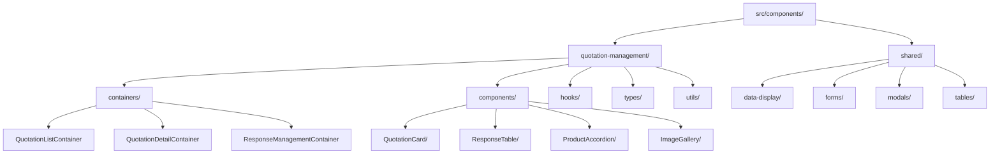

# Refactoring Design: Gestión de Cotización Module

## Overview

This document outlines a comprehensive refactoring strategy for the `gestion-de-cotizacion` module to improve code organization, maintainability, and reusability following modern React and TypeScript best practices.

## Current Architecture Analysis

### Issues Identified

1. **Monolithic Components**: Large files with mixed responsibilities (844 lines in main view)
2. **Deep Nesting**: Excessive folder depth limiting discoverability
3. **Code Duplication**: Similar logic scattered across components
4. **Poor Separation of Concerns**: Business logic mixed with UI components
5. **Inconsistent Naming**: Typos and mixed naming conventions
6. **Missing Documentation**: Limited inline comments and component documentation

### Current Structure Problems

```
src/pages/gestion-de-cotizacion/
├── components/
│   ├── quotation-response/ (10 items, deeply nested)
│   ├── table/ (2 items)
│   ├── utils/ (2 items) 
│   └── views/ (8+ items, large files)
├── utils/ (5 items with tests)
└── gestion-de-cotizacion-view.tsx (844 lines - too large)
```

## Target Architecture Design

### 1. Modular Component Architecture



### 2. Refactored Folder Structure

```
src/
├── components/
│   ├── quotation-management/           # Business-specific components
│   │   ├── containers/
│   │   │   ├── QuotationListContainer.tsx
│   │   │   ├── QuotationDetailContainer.tsx
│   │   │   └── ResponseManagementContainer.tsx
│   │   ├── components/
│   │   │   ├── QuotationCard/
│   │   │   │   ├── QuotationCard.tsx
│   │   │   │   ├── QuotationCard.types.ts
│   │   │   │   └── QuotationCard.styles.ts
│   │   │   ├── ResponseTable/
│   │   │   │   ├── ResponseTable.tsx
│   │   │   │   ├── ResponseTable.types.ts
│   │   │   │   └── columns.tsx
│   │   │   ├── ProductAccordion/
│   │   │   │   ├── ProductAccordion.tsx
│   │   │   │   ├── ProductItem.tsx
│   │   │   │   └── ProductAccordion.types.ts
│   │   │   └── QuotationFilters/
│   │   │       ├── QuotationFilters.tsx
│   │   │       └── QuotationFilters.types.ts
│   │   ├── hooks/
│   │   │   ├── useQuotationFilters.ts
│   │   │   ├── useQuotationNavigation.ts
│   │   │   └── useResponseManagement.ts
│   │   ├── types/
│   │   │   ├── quotation.types.ts
│   │   │   ├── response.types.ts
│   │   │   └── index.ts
│   │   └── utils/
│   │       ├── quotation.utils.ts
│   │       ├── response.utils.ts
│   │       ├── calculations.utils.ts
│   │       └── validation.utils.ts
│   └── shared/                         # Reusable components
│       ├── data-display/
│       │   ├── ImageGallery/
│       │   │   ├── ImageGallery.tsx
│       │   │   ├── ImageModal.tsx
│       │   │   └── ImageGallery.types.ts
│       │   ├── StatusBadge/
│       │   │   ├── StatusBadge.tsx
│       │   │   └── StatusBadge.types.ts
│       │   └── ProductAccordion/       # Moved from specific module
│       │       ├── ProductAccordion.tsx
│       │       └── ProductAccordion.types.ts
│       ├── forms/
│       │   ├── SearchInput/
│       │   │   ├── SearchInput.tsx
│       │   │   └── SearchInput.types.ts
│       │   └── FilterSelect/
│       │       ├── FilterSelect.tsx
│       │       └── FilterSelect.types.ts
│       ├── modals/
│       │   ├── ConfirmationModal/
│       │   │   ├── ConfirmationModal.tsx
│       │   │   └── ConfirmationModal.types.ts
│       │   └── ImageCarousel/          # Refactored existing component
│       │       ├── ImageCarousel.tsx
│       │       └── ImageCarousel.types.ts
│       └── tables/
│           ├── ResponsiveDataTable/
│           │   ├── ResponsiveDataTable.tsx
│           │   ├── ResponsiveDataTable.types.ts
│           │   └── columns.utils.tsx
│           └── EditableTable/
│               ├── EditableTable.tsx
│               ├── EditableCell.tsx
│               └── EditableTable.types.ts
└── pages/
    └── gestion-de-cotizacion/
        └── GestionDeCotizacionPage.tsx  # Simplified main page
```

## Component Refactoring Strategy

### 3. Container Components (Smart Components)

#### QuotationListContainer
```typescript
/**
 * Container component for quotation list management
 * Handles data fetching, filtering, and pagination logic
 */
interface QuotationListContainerProps {
  onQuotationSelect: (quotationId: string) => void;
  onViewMode: (mode: 'list' | 'details' | 'responses') => void;
}

const QuotationListContainer: React.FC<QuotationListContainerProps> = ({
  onQuotationSelect,
  onViewMode,
}) => {
  // Data fetching and state management logic
  // Filtering and search logic  
  // Pagination logic
  
  return (
    <div>
      <QuotationFilters {...filterProps} />
      <QuotationList {...listProps} />
      <Pagination {...paginationProps} />
    </div>
  );
};
```

#### ResponseManagementContainer
```typescript
/**
 * Container for managing quotation responses
 * Handles response CRUD operations and state management
 */
interface ResponseManagementContainerProps {
  quotationId: string;
  mode: 'admin' | 'user';
  readonly?: boolean;
}

const ResponseManagementContainer: React.FC<ResponseManagementContainerProps> = ({
  quotationId,
  mode,
  readonly = false,
}) => {
  // Response data management
  // Error handling and loading states
  // Business logic for response operations
  
  return (
    <div>
      <ResponseTable {...tableProps} />
      <ResponseActions {...actionProps} />
    </div>
  );
};
```

### 4. Presentation Components (Dumb Components)

#### QuotationCard Component
```typescript
/**
 * Reusable card component for displaying quotation information
 * Pure component with no business logic
 */
interface QuotationCardProps {
  quotation: QuotationData;
  onViewDetails: (id: string) => void;
  onViewResponses: (id: string) => void;
  showActions?: boolean;
  compact?: boolean;
}

const QuotationCard: React.FC<QuotationCardProps> = ({
  quotation,
  onViewDetails,
  onViewResponses,
  showActions = true,
  compact = false,
}) => {
  return (
    <Card className={cn("hover:shadow-lg transition-shadow", { compact })}>
      <CardHeader>
        <QuotationHeader quotation={quotation} />
        <StatusBadge status={quotation.status} />
      </CardHeader>
      
      <CardContent>
        <ProductAccordion products={quotation.products} />
      </CardContent>
      
      {showActions && (
        <CardFooter>
          <QuotationActions 
            onViewDetails={() => onViewDetails(quotation.id)}
            onViewResponses={() => onViewResponses(quotation.id)}
          />
        </CardFooter>
      )}
    </Card>
  );
};
```

### 5. Shared Components for Reusability

#### ImageGallery Component
```typescript
/**
 * Reusable image gallery with modal support
 * Can be used across different modules
 */
interface ImageGalleryProps {
  images: ImageData[];
  title: string;
  showThumbnails?: boolean;
  allowDownload?: boolean;
  onImageClick?: (index: number) => void;
}

const ImageGallery: React.FC<ImageGalleryProps> = ({
  images,
  title,
  showThumbnails = true,
  allowDownload = false,
  onImageClick,
}) => {
  const [selectedIndex, setSelectedIndex] = useState<number | null>(null);
  
  return (
    <>
      <div className="grid grid-cols-2 md:grid-cols-4 gap-2">
        {images.map((image, index) => (
          <ImageThumbnail
            key={index}
            src={image.url}
            alt={image.alt}
            onClick={() => setSelectedIndex(index)}
          />
        ))}
      </div>
      
      <ImageModal
        isOpen={selectedIndex !== null}
        images={images}
        currentIndex={selectedIndex}
        onClose={() => setSelectedIndex(null)}
        allowDownload={allowDownload}
      />
    </>
  );
};
```

#### ResponsiveDataTable Component  
```typescript
/**
 * Enhanced data table component with responsive design
 * Extends existing DataTable with mobile optimization
 */
interface ResponsiveDataTableProps<T> {
  data: T[];
  columns: ColumnDef<T>[];
  mobileColumns?: ColumnDef<T>[];
  onRowClick?: (row: T) => void;
  loading?: boolean;
  error?: string;
}

const ResponsiveDataTable = <T,>({
  data,
  columns,
  mobileColumns,
  onRowClick,
  loading,
  error,
}: ResponsiveDataTableProps<T>) => {
  const isMobile = useIsMobile();
  
  const effectiveColumns = useMemo(() => {
    return isMobile && mobileColumns ? mobileColumns : columns;
  }, [isMobile, columns, mobileColumns]);
  
  if (loading) return <TableSkeleton />;
  if (error) return <TableError message={error} />;
  
  return (
    <DataTable
      columns={effectiveColumns}
      data={data}
      onRowClick={onRowClick}
    />
  );
};
```

## Custom Hooks Strategy

### 6. Business Logic Hooks

#### useQuotationFilters Hook
```typescript
/**
 * Hook for managing quotation filtering state and logic
 * Provides debounced search and filter state management
 */
interface UseQuotationFiltersProps {
  initialFilters?: QuotationFilters;
  onFiltersChange?: (filters: QuotationFilters) => void;
}

const useQuotationFilters = ({
  initialFilters = {},
  onFiltersChange,
}: UseQuotationFiltersProps = {}) => {
  const [searchTerm, setSearchTerm] = useState("");
  const [debouncedSearchTerm, setDebouncedSearchTerm] = useState("");
  const [statusFilter, setStatusFilter] = useState<string>("all");
  
  // Debounce search term
  useEffect(() => {
    const timer = setTimeout(() => {
      setDebouncedSearchTerm(searchTerm);
    }, 500);
    return () => clearTimeout(timer);
  }, [searchTerm]);
  
  // Notify parent of filter changes
  useEffect(() => {
    const filters = {
      searchTerm: debouncedSearchTerm,
      status: statusFilter,
    };
    onFiltersChange?.(filters);
  }, [debouncedSearchTerm, statusFilter, onFiltersChange]);
  
  const clearFilters = useCallback(() => {
    setSearchTerm("");
    setStatusFilter("all");
  }, []);
  
  return {
    filters: {
      searchTerm,
      debouncedSearchTerm,
      statusFilter,
    },
    actions: {
      setSearchTerm,
      setStatusFilter,
      clearFilters,
    },
  };
};
```

#### useResponseManagement Hook
```typescript
/**
 * Hook for managing quotation response operations
 * Handles CRUD operations with proper error handling
 */
const useResponseManagement = (quotationId: string) => {
  const [activeResponseId, setActiveResponseId] = useState<string>("");
  const [editMode, setEditMode] = useState<boolean>(false);
  
  const {
    data: responses,
    isLoading,
    error,
    refetch,
  } = useGetQuotationResponse(quotationId);
  
  const updateResponseMutation = useUpdateResponse({
    onSuccess: () => {
      toast.success("Response updated successfully");
      setEditMode(false);
    },
    onError: (error) => {
      toast.error(`Failed to update response: ${error.message}`);
    },
  });
  
  const activateResponse = useCallback((responseId: string) => {
    setActiveResponseId(responseId);
  }, []);
  
  const toggleEditMode = useCallback(() => {
    setEditMode(prev => !prev);
  }, []);
  
  return {
    state: {
      responses,
      activeResponseId,
      editMode,
      isLoading,
      error,
    },
    actions: {
      activateResponse,
      toggleEditMode,
      refetch,
      updateResponse: updateResponseMutation.mutate,
    },
  };
};
```

## Utility Functions Strategy

### 7. Pure Utility Functions

#### quotation.utils.ts
```typescript
/**
 * Utility functions for quotation data manipulation
 * Pure functions with no side effects
 */

export const formatQuotationStatus = (status: string): string => {
  const statusLabels: Record<string, string> = {
    draft: "Borrador",
    pending: "Pendiente", 
    approved: "Aprobado",
    cancelled: "Cancelado",
    completed: "Completado",
  };
  
  return statusLabels[status] || status;
};

export const getStatusColor = (status: string): string => {
  const statusColors: Record<string, string> = {
    draft: "bg-gray-100 text-gray-800",
    pending: "bg-yellow-100 text-yellow-800",
    approved: "bg-green-100 text-green-800", 
    cancelled: "bg-red-100 text-red-800",
    completed: "bg-blue-100 text-blue-800",
  };
  
  return statusColors[status] || "bg-gray-100 text-gray-800";
};

export const sortQuotationsByDate = (
  quotations: QuotationData[],
  direction: 'asc' | 'desc' = 'desc'
): QuotationData[] => {
  return [...quotations].sort((a, b) => {
    const dateA = new Date(a.createdAt).getTime();
    const dateB = new Date(b.createdAt).getTime();
    return direction === 'desc' ? dateB - dateA : dateA - dateB;
  });
};

export const filterQuotationsByStatus = (
  quotations: QuotationData[],
  status: string
): QuotationData[] => {
  if (status === 'all') return quotations;
  return quotations.filter(q => q.status === status);
};

export const searchQuotations = (
  quotations: QuotationData[],
  searchTerm: string
): QuotationData[] => {
  if (!searchTerm.trim()) return quotations;
  
  const term = searchTerm.toLowerCase();
  return quotations.filter(q => 
    q.correlative.toLowerCase().includes(term) ||
    q.clientName.toLowerCase().includes(term) ||
    q.id.toLowerCase().includes(term)
  );
};
```

#### calculations.utils.ts (Enhanced)
```typescript
/**
 * Enhanced calculation utilities with better type safety
 * Moved from page-specific utils to shared utilities
 */

export interface CalculationResult {
  success: boolean;
  value: number;
  error?: string;
}

export const safeCalculate = (
  calculation: () => number,
  fallback: number = 0
): CalculationResult => {
  try {
    const value = calculation();
    
    if (!isFinite(value)) {
      return {
        success: false,
        value: fallback,
        error: 'Calculation resulted in invalid number',
      };
    }
    
    return {
      success: true,
      value,
    };
  } catch (error) {
    return {
      success: false,
      value: fallback,
      error: error instanceof Error ? error.message : 'Unknown calculation error',
    };
  }
};

export const calculateVariantTotals = (variants: VariantData[]): VariantTotals => {
  return variants.reduce((totals, variant) => ({
    totalPrice: totals.totalPrice + (variant.price * variant.quantity),
    totalExpress: totals.totalExpress + variant.express,
    totalQuantity: totals.totalQuantity + variant.quantity,
    totalUnitCost: totals.totalUnitCost + (variant.unitCost * variant.quantity),
    totalImportCosts: totals.totalImportCosts + variant.importCosts,
  }), {
    totalPrice: 0,
    totalExpress: 0,
    totalQuantity: 0,
    totalUnitCost: 0,
    totalImportCosts: 0,
  });
};
```

## Type Definitions Strategy

### 8. Centralized Type Management

#### types/quotation.types.ts
```typescript
/**
 * Centralized type definitions for quotation domain
 * Provides type safety across components
 */

export interface QuotationData {
  id: string;
  correlative: string;
  clientName: string;
  status: QuotationStatus;
  createdAt: string;
  updatedAt: string;
  products: ProductData[];
  totalValue: number;
  responseCount: number;
}

export interface ProductData {
  id: string;
  name: string;
  description: string;
  images: string[];
  variants: VariantData[];
  cbm: number;
  weight: number;
  boxes: number;
}

export interface VariantData {
  id: string;
  name: string;
  quantity: number;
  price: number;
  express: number;
  unitCost: number;
  importCosts: number;
}

export type QuotationStatus = 
  | 'draft'
  | 'pending' 
  | 'approved'
  | 'cancelled'
  | 'completed'
  | 'answered';

export interface QuotationFilters {
  searchTerm?: string;
  status?: string;
  dateFrom?: string;
  dateTo?: string;
}

export interface PaginationInfo {
  pageNumber: number;
  pageSize: number;
  totalElements: number;
  totalPages: number;
}

// Component Props Types
export interface QuotationCardProps {
  quotation: QuotationData;
  onViewDetails: (id: string) => void;
  onViewResponses: (id: string) => void;
  showActions?: boolean;
  compact?: boolean;
}

export interface QuotationFiltersProps {
  filters: QuotationFilters;
  onFiltersChange: (filters: QuotationFilters) => void;
  onClearFilters: () => void;
  loading?: boolean;
}
```

## Main Page Refactoring

### 9. Simplified Main Page Component

#### GestionDeCotizacionPage.tsx (Simplified)
```typescript
/**
 * Main page component - simplified and focused
 * Delegates complex logic to container components
 */
import React, { useState } from 'react';
import { QuotationListContainer } from '@/components/quotation-management/containers/QuotationListContainer';
import { QuotationDetailContainer } from '@/components/quotation-management/containers/QuotationDetailContainer';
import { ResponseManagementContainer } from '@/components/quotation-management/containers/ResponseManagementContainer';
import { PageHeader } from '@/components/shared/layout/PageHeader';
import { NavigationBreadcrumbs } from '@/components/shared/layout/NavigationBreadcrumbs';

type ViewMode = 'list' | 'details' | 'responses';

export const GestionDeCotizacionPage: React.FC = () => {
  const [viewMode, setViewMode] = useState<ViewMode>('list');
  const [selectedQuotationId, setSelectedQuotationId] = useState<string>('');

  const handleQuotationSelect = (quotationId: string) => {
    setSelectedQuotationId(quotationId);
  };

  const handleViewModeChange = (mode: ViewMode) => {
    setViewMode(mode);
  };

  const handleBackToList = () => {
    setViewMode('list');
    setSelectedQuotationId('');
  };

  return (
    <div className="min-h-screen bg-gray-50">
      <PageHeader
        title="Panel de Administración de Cotizaciones"
        subtitle="Gestiona las cotizaciones de tus productos"
        icon="FileText"
      />
      
      <div className="container mx-auto px-4 py-6">
        <NavigationBreadcrumbs 
          viewMode={viewMode}
          onBackToList={handleBackToList}
        />
        
        {viewMode === 'list' && (
          <QuotationListContainer
            onQuotationSelect={handleQuotationSelect}
            onViewMode={handleViewModeChange}
          />
        )}
        
        {viewMode === 'details' && selectedQuotationId && (
          <QuotationDetailContainer
            quotationId={selectedQuotationId}
            onBack={handleBackToList}
          />
        )}
        
        {viewMode === 'responses' && selectedQuotationId && (
          <ResponseManagementContainer
            quotationId={selectedQuotationId}
            mode="admin"
            onBack={handleBackToList}
          />
        )}
      </div>
    </div>
  );
};

export default GestionDeCotizacionPage;
```

## Testing Strategy

### 10. Component Testing Structure

```typescript
/**
 * Example test structure for refactored components
 * Following best practices for React Testing Library
 */

// QuotationCard.test.tsx
describe('QuotationCard', () => {
  const mockQuotation = {
    id: '1',
    correlative: 'Q-001',
    clientName: 'Test Client',
    status: 'pending' as const,
    createdAt: '2024-01-01',
    updatedAt: '2024-01-01',
    products: [],
    totalValue: 1000,
    responseCount: 2,
  };

  it('renders quotation information correctly', () => {
    const onViewDetails = jest.fn();
    const onViewResponses = jest.fn();
    
    render(
      <QuotationCard
        quotation={mockQuotation}
        onViewDetails={onViewDetails}
        onViewResponses={onViewResponses}
      />
    );
    
    expect(screen.getByText('Q-001')).toBeInTheDocument();
    expect(screen.getByText('Test Client')).toBeInTheDocument();
  });

  it('calls onViewDetails when details button is clicked', () => {
    const onViewDetails = jest.fn();
    const onViewResponses = jest.fn();
    
    render(
      <QuotationCard
        quotation={mockQuotation}
        onViewDetails={onViewDetails}
        onViewResponses={onViewResponses}
      />
    );
    
    fireEvent.click(screen.getByRole('button', { name: /ver detalles/i }));
    expect(onViewDetails).toHaveBeenCalledWith('1');
  });
});
```

## Migration Strategy

### 11. Phased Implementation Approach

#### Phase 1: Foundation Setup
1. Create new folder structure in `src/components/`
2. Move and refactor utility functions to shared utilities
3. Create centralized type definitions
4. Set up new custom hooks

#### Phase 2: Component Extraction
1. Extract reusable components (ImageGallery, StatusBadge, etc.)
2. Create container components for business logic
3. Refactor large components into smaller, focused components
4. Implement new custom hooks

#### Phase 3: Integration and Testing
1. Update main page to use new container components
2. Add comprehensive test coverage
3. Update documentation and comments
4. Performance optimization and cleanup

#### Phase 4: Cleanup and Optimization
1. Remove old, unused files
2. Update import paths throughout the application
3. Final performance optimization
4. Code review and quality assurance

## Benefits Expected

### 12. Improvement Outcomes

1. **Maintainability**: Smaller, focused components easier to understand and modify
2. **Reusability**: Shared components can be used across different modules
3. **Testability**: Isolated components and pure functions easier to test
4. **Type Safety**: Centralized type definitions reduce type-related errors
5. **Performance**: Better component memoization and lazy loading opportunities
6. **Developer Experience**: Clear structure and documentation improve productivity
7. **Scalability**: Modular architecture supports future feature additions

### 13. Code Quality Metrics

- **Component Size**: Average component size < 200 lines
- **Cyclomatic Complexity**: Functions complexity < 10
- **Test Coverage**: > 80% test coverage for critical components
- **Type Safety**: 100% TypeScript coverage with strict mode
- **Documentation**: All public interfaces documented with JSDoc
- **Performance**: < 3s initial load time, < 1s navigation between views