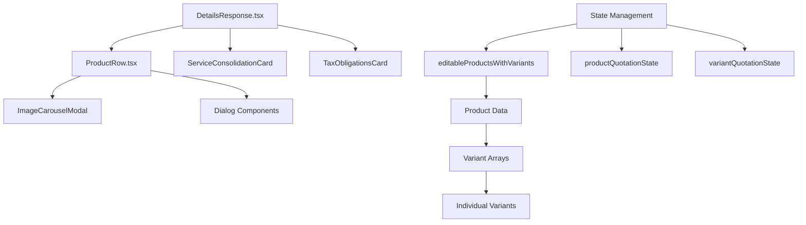
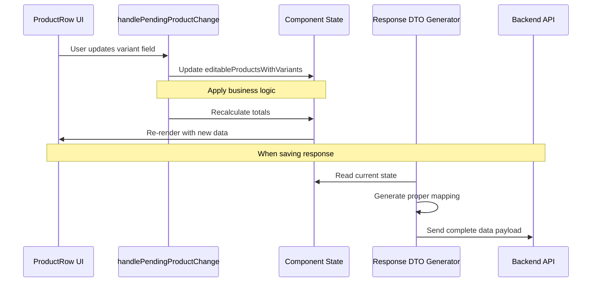
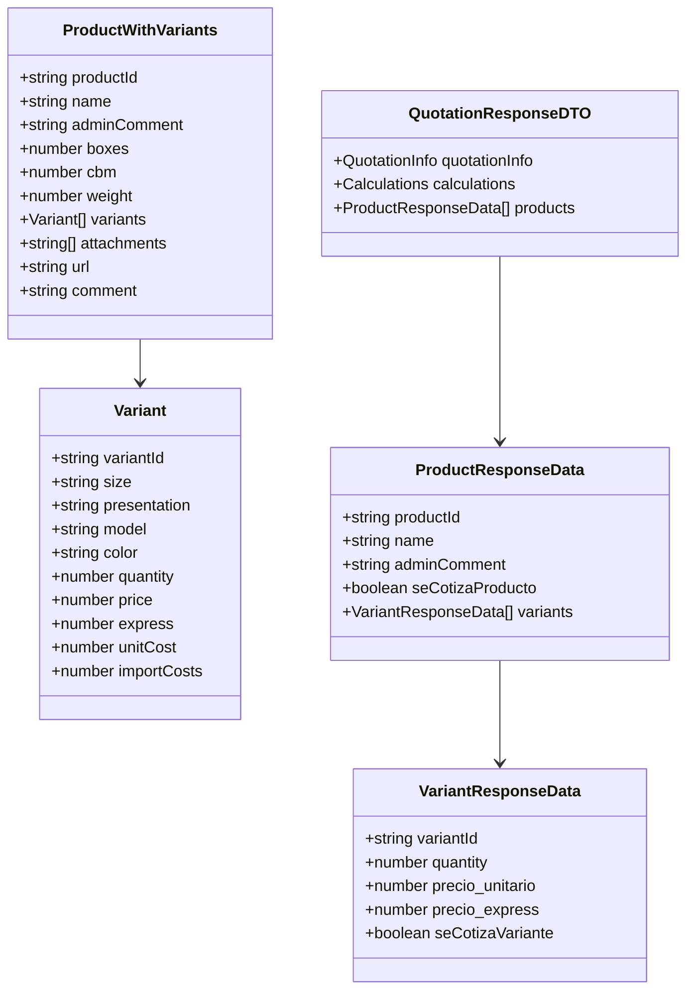

# Update Product Variant Logic Design

## Overview

This design addresses critical issues in the quotation management system related to product variant handling, data flow inconsistencies, and code optimization. The current implementation has logic mismatches between single and multiple variant products, incorrect data mapping in update functions, and missing essential data in response DTOs.

## Current Issues Analysis

### Data Flow Problems

#### Variant Price Mapping Issue
- **Problem**: The `generateQuotationResponseDTO` function incorrectly maps variant pricing data
- **Current Mapping**: 
  ```
  precio_unitario: editableVariant?.unitCost || 0
  precio_express: editableVariant?.importCosts || 0
  ```
- **Expected Mapping**:
  ```
  precio_unitario: editableVariant?.price || 0
  precio_express: editableVariant?.express || 0
  ```

#### Missing Critical Data
- **Admin Comments**: Not properly transmitted to response DTO
- **Total CBM and Weight**: Missing from quotation response calculations
- **Packing List Data**: Incomplete transmission of boxes, CBM, and weight data

#### Inconsistent Update Logic
- **Single Variant Products**: Use different update pattern than multiple variant products
- **Field Naming**: Inconsistent between component state and API payload
- **State Management**: Multiple state objects managing similar data with different structures

## Architecture Design

### Component Hierarchy



### Data Flow Architecture



### Updated Data Model Structure



## Implementation Strategy

### Phase 1: Fix Data Mapping Logic

#### Update handlePendingProductChange Function

```typescript
const handlePendingProductChange = (
  productId: string,
  field: string,
  value: number | string
) => {
  // Handle variant field updates with proper naming
  if (field.startsWith("variant_")) {
    const [, variantIndex, variantField] = field.split("_");
    
    setEditableProductsWithVariants((prev) =>
      prev.map((product) => {
        if (product.id === productId || product.productId === productId) {
          const updatedVariants = [...(product.variants || [])];
          if (updatedVariants[parseInt(variantIndex)]) {
            updatedVariants[parseInt(variantIndex)] = {
              ...updatedVariants[parseInt(variantIndex)],
              [variantField]: value,
            };
          }
          
          return {
            ...product,
            variants: updatedVariants,
          };
        }
        return product;
      })
    );
  }
  
  // Handle packing list updates
  if (["boxes", "cbm", "weight"].includes(field)) {
    setEditableProductsWithVariants((prev) =>
      prev.map((product) => {
        if (product.id === productId || product.productId === productId) {
          return {
            ...product,
            [field]: value,
          };
        }
        return product;
      })
    );
  }
  
  // Handle admin comment updates
  if (field === "adminComment") {
    setEditableProductsWithVariants((prev) =>
      prev.map((product) => {
        if (product.id === productId || product.productId === productId) {
          return {
            ...product,
            adminComment: value as string,
          };
        }
        return product;
      })
    );
  }
};
```

#### Fix Response DTO Generation

```typescript
const generateQuotationResponseDTO = () => {
  // Calculate total CBM and weight from products
  const totalCBM = editableProductsWithVariants.reduce(
    (sum, product) => sum + (product.cbm || 0),
    0
  );
  
  const totalWeight = editableProductsWithVariants.reduce(
    (sum, product) => sum + (product.weight || 0),
    0
  );
  
  return {
    quotationInfo: {
      // ... existing fields
      cbm_total: totalCBM,
      peso_total: totalWeight,
      // ... rest of fields
    },
    calculations: {
      // ... existing calculations
    },
    products: quotationDetail?.products?.map((product: any) => {
      const editableProduct = editableProductsWithVariants.find(
        (ep) => ep.id === product.productId
      );
      
      return {
        productId: product.productId,
        name: product.name,
        adminComment: editableProduct?.adminComment || "",
        seCotizaProducto: productQuotationState[product.productId] !== false,
        variants: (product.variants || []).map((variant: any) => {
          const editableVariant = editableProduct?.variants?.find(
            (ev: any) => ev.variantId === variant.variantId || ev.id === variant.variantId
          );
          
          return {
            variantId: variant.variantId,
            quantity: Number(variant.quantity) || 0,
            precio_unitario: editableVariant?.price || 0,     // Fixed mapping
            precio_express: editableVariant?.express || 0,    // Fixed mapping
            seCotizaVariante: variantQuotationState[product.productId]?.[variant.variantId] !== false,
          };
        }),
      };
    }) || [],
  };
};
```

### Phase 2: Standardize Single vs Multi-Variant Logic

#### ProductRow Component Enhancement

```typescript
interface ProductRowProps {
  product: ProductWithVariants;
  index: number;
  quotationDetail?: QuotationDetail;
  onProductChange: (productId: string, field: string, value: number | string) => void;
  editableProducts: ProductWithVariants[];
  productQuotationState: Record<string, boolean>;
  variantQuotationState: Record<string, Record<string, boolean>>;
  onProductQuotationChange: (productId: string, checked: boolean) => void;
  onVariantQuotationChange: (productId: string, variantId: string, checked: boolean) => void;
}

const ProductRow: React.FC<ProductRowProps> = ({
  product,
  onProductChange,
  // ... other props
}) => {
  const hasMultipleVariants = variants.length > 1;
  
  // Unified variant change handler
  const handleVariantFieldChange = (
    variantIndex: number,
    field: string,
    value: number
  ) => {
    if (hasMultipleVariants) {
      // For multiple variants, use variant-specific field naming
      onProductChange(getProductId(), `variant_${variantIndex}_${field}`, value);
    } else {
      // For single variant, use simplified naming
      onProductChange(getProductId(), `variant_0_${field}`, value);
    }
  };
  
  // Rest of component logic remains similar but uses unified handler
};
```

### Phase 3: Code Refactoring and Optimization

#### Remove Redundant State Management

```typescript
// Consolidate state objects
interface ConsolidatedProductState {
  editableProducts: ProductWithVariants[];
  quotationStates: {
    products: Record<string, boolean>;
    variants: Record<string, Record<string, boolean>>;
  };
}

// Remove redundant state variables:
// - editablePendingProducts (merge into editableProductsWithVariants)
// - editableUnitCostProducts (use same structure with mode flag)
```

#### Modularize Business Logic

```typescript
// Extract calculation utilities
export const calculateProductTotals = (variants: Variant[]) => {
  return variants.reduce((totals, variant) => ({
    totalPrice: totals.totalPrice + (variant.price * variant.quantity),
    totalExpress: totals.totalExpress + variant.express,
    totalQuantity: totals.totalQuantity + variant.quantity,
  }), { totalPrice: 0, totalExpress: 0, totalQuantity: 0 });
};

// Extract validation utilities
export const validateProductData = (product: ProductWithVariants): ValidationResult => {
  const errors: string[] = [];
  
  if (!product.variants?.length) {
    errors.push("Product must have at least one variant");
  }
  
  product.variants?.forEach((variant, index) => {
    if (!variant.quantity || variant.quantity <= 0) {
      errors.push(`Variant ${index + 1} must have quantity > 0`);
    }
  });
  
  return {
    isValid: errors.length === 0,
    errors,
  };
};
```

## Testing Strategy

### Unit Tests

```typescript
// Test variant update logic
describe('handlePendingProductChange', () => {
  it('should update single variant price correctly', () => {
    // Test single variant update
  });
  
  it('should update multiple variant express costs correctly', () => {
    // Test multi-variant update
  });
  
  it('should handle packing list updates', () => {
    // Test boxes, CBM, weight updates
  });
  
  it('should preserve admin comments', () => {
    // Test admin comment persistence
  });
});

// Test DTO generation
describe('generateQuotationResponseDTO', () => {
  it('should map variant prices correctly', () => {
    // Test correct price mapping
  });
  
  it('should include total CBM and weight', () => {
    // Test totals calculation
  });
  
  it('should include admin comments', () => {
    // Test comment inclusion
  });
});
```

### Integration Tests

```typescript
// Test complete workflow
describe('Product Variant Workflow', () => {
  it('should handle single variant product lifecycle', () => {
    // Test creation, update, and DTO generation for single variant
  });
  
  it('should handle multi-variant product lifecycle', () => {
    // Test creation, update, and DTO generation for multiple variants
  });
  
  it('should maintain data consistency across updates', () => {
    // Test state consistency
  });
});
```

## Migration Plan

### Step 1: Backup Current Implementation
- Create backup of existing components
- Document current behavior for regression testing

### Step 2: Implement Core Fixes
- Update `handlePendingProductChange` logic
- Fix DTO generation mapping
- Add missing data fields

### Step 3: Refactor Component Structure
- Consolidate state management
- Standardize variant handling logic
- Extract reusable utilities

### Step 4: Code Cleanup
- Remove unused components and functions
- Consolidate duplicate logic
- Optimize performance bottlenecks

### Step 5: Testing and Validation
- Run comprehensive test suite
- Perform user acceptance testing
- Monitor for edge cases

## Performance Optimizations

### Memoization Strategy

```typescript
// Memoize expensive calculations
const productTotals = useMemo(() => {
  return calculateProductTotals(editableProductsWithVariants);
}, [editableProductsWithVariants]);

// Memoize DTO generation
const quotationDTO = useMemo(() => {
  return generateQuotationResponseDTO();
}, [editableProductsWithVariants, dynamicValues, serviceFields]);
```

### State Update Optimization

```typescript
// Use functional updates to prevent unnecessary re-renders
const updateProductVariant = useCallback((
  productId: string,
  variantIndex: number,
  field: string,
  value: number
) => {
  setEditableProductsWithVariants(prev => 
    prev.map(product => {
      if (product.id === productId) {
        const newVariants = [...product.variants];
        newVariants[variantIndex] = {
          ...newVariants[variantIndex],
          [field]: value
        };
        return { ...product, variants: newVariants };
      }
      return product;
    })
  );
}, []);
```

## Error Handling and Validation

### Input Validation

```typescript
const validateVariantInput = (field: string, value: number): ValidationResult => {
  switch (field) {
    case 'price':
    case 'express':
      if (value < 0) {
        return { isValid: false, error: 'Price cannot be negative' };
      }
      break;
    case 'quantity':
      if (!Number.isInteger(value) || value <= 0) {
        return { isValid: false, error: 'Quantity must be a positive integer' };
      }
      break;
  }
  return { isValid: true };
};
```

### Error Boundaries

```typescript
// Add error boundary around ProductRow components
const ProductRowWithErrorBoundary: React.FC<ProductRowProps> = (props) => (
  <ErrorBoundary
    fallback={<ProductRowErrorFallback productId={props.product.id} />}
    onError={(error) => console.error('ProductRow error:', error)}
  >
    <ProductRow {...props} />
  </ErrorBoundary>
);
```

## Future Enhancements

### Extensibility Considerations
- Plugin architecture for custom variant types
- Configurable validation rules
- Internationalization support for multi-language quotations

### Performance Monitoring
- Add performance metrics for large product lists
- Implement virtual scrolling for extensive variant collections
- Monitor memory usage in complex quotation scenarios