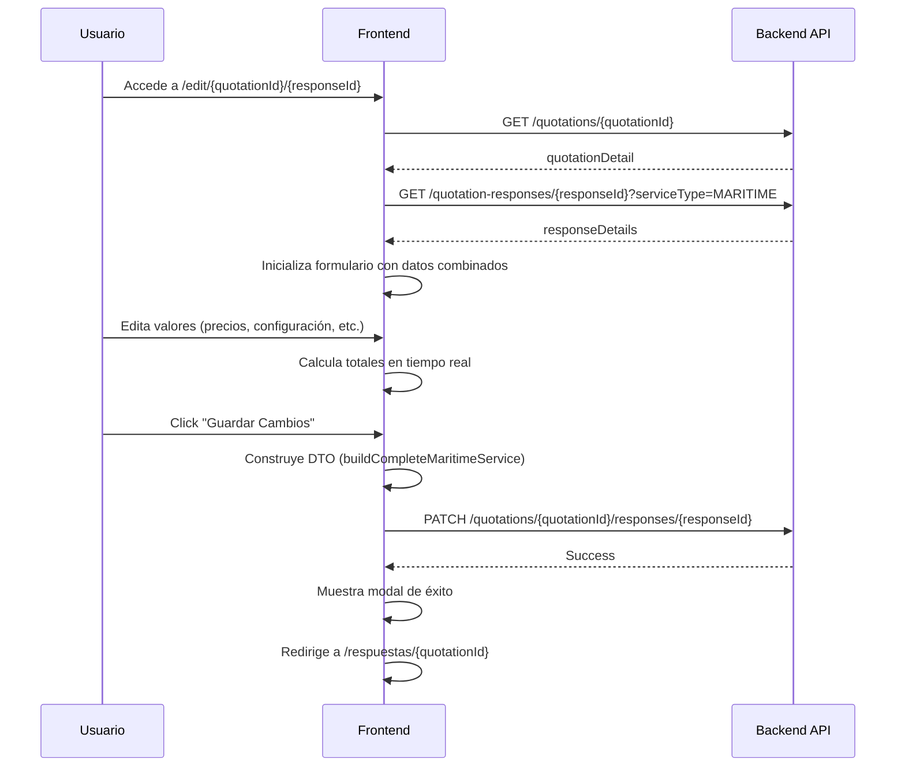

# Documentación - Edición de Respuestas de Cotización

## Vista General

Este documento describe la lógica de edición de respuestas de cotización en el frontend (`edit-quotation-response-view.tsx`), incluyendo los endpoints utilizados para obtener y enviar información.

---

## 1. Endpoints de Obtención de Datos (GET)

### 1.1 Obtener Detalles de la Cotización Base

**Hook Utilizado:** `useGetQuotationById`

```typescript
const {
  data: quotationDetail,
  isLoading: isLoadingQuotation,
  isError: isErrorQuotation,
} = useGetQuotationById(quotationId || "");
```

**Propósito:**
- Obtiene la información original de la cotización creada por el cliente
- Incluye los productos, variantes, cantidades, URLs, comentarios y adjuntos originales

**Datos Importantes que Retorna:**
- `products[]`: Array de productos solicitados
  - `productId`: ID del producto
  - `name`: Nombre del producto
  - `url`: URL del producto
  - `comment`: Comentario del cliente
  - `quantityTotal`: Cantidad total solicitada
  - `number_of_boxes`: Número de cajas
  - `volume`: Volumen (CBM)
  - `weight`: Peso (kg)
  - `attachments[]`: Archivos adjuntos
  - `variants[]`: Variantes del producto
    - `variantId`: ID de la variante
    - `size`: Talla
    - `presentation`: Presentación
    - `model`: Modelo
    - `color`: Color
    - `quantity`: Cantidad de esta variante

---

### 1.2 Obtener Detalles de la Respuesta de Cotización

**Hook Utilizado:** `useGetDetailsResponse`

```typescript
const {
  data: responseDetails,
  isLoading: isLoadingResponse,
  isError: isErrorResponse,
} = useGetDetailsResponse(responseId || "", serviceType);
```

**Parámetros:**
- `responseId`: ID de la respuesta de cotización
- `serviceType`: Tipo de servicio (`"PENDING"`, `"MARITIME"`, `"EXPRESS"`)

**Propósito:**
- Obtiene los datos previamente guardados de la respuesta de cotización
- Incluye configuraciones, precios, cálculos y estados de cotización

**Estructura de Datos que Retorna:**

```typescript
{
  serviceType: "PENDING" | "MARITIME" | "EXPRESS",
  responseData: {
    generalInformation: {
      serviceLogistic: string,      // "Pendiente", "Maritimo", "Express"
      incoterm: string,              // "FOB", "CIF", etc.
      cargoType: string,             // "FCL", "LCL", etc.
      courier: string                // "DHL", "FedEx", etc.
    },

    // Solo para MARITIME
    maritimeConfig?: {
      regime: string,                // "Importación Definitiva"
      originCountry: string,         // "China"
      destinationCountry: string,    // "Perú"
      customs: string,               // "Callao"
      originPort: string,            // "Shanghai"
      destinationPort: string,       // "Callao"
      serviceTypeDetail: string,     // "FCL", "LCL"
      transitTime: number,           // 25 días
      naviera: string,               // "COSCO"
      proformaValidity: string       // "30 días"
    },

    // Para MARITIME y EXPRESS (ResponseDataComplete)
    calculations?: {
      dynamicValues: {
        comercialValue: number,
        flete: number,
        cajas: number,
        kg: number,
        ton: number,
        fob: number,
        seguro: number,
        tipoCambio: number,
        volumenCBM: number,
        calculoFlete: number,
        servicioConsolidado: number,
        separacionCarga: number,
        inspeccionProductos: number,
        gestionCertificado: number,
        desaduanaje: number,
        antidumpingGobierno: number,
        antidumpingCantidad: number,
        transporteLocalChinaEnvio: number,
        transporteLocalClienteEnvio: number,
        cif: number
      },
      taxPercentage: {
        adValoremRate: number,
        igvRate: number,
        ipmRate: number,
        percepcion: number
      },
      exemptions: {
        obligacionesFiscales: boolean,
        separacionCarga: boolean,
        inspeccionProductos: boolean,
        servicioConsolidadoAereo: boolean,
        servicioConsolidadoMaritimo: boolean,
        gestionCertificado: boolean,
        servicioInspeccion: boolean,
        totalDerechos: boolean,
        descuentoGrupalExpress: boolean
      }
    }
  },

  products: [
    {
      productId: string,
      isQuoted: boolean,            // Si el producto está cotizado
      adminComment?: string,        // Comentario del administrador
      ghostUrl?: string,            // URL alternativa del producto

      // Para PENDING
      packingList?: {
        nroBoxes: number,
        cbm: number,
        pesoKg: number,
        pesoTn: number
      },
      cargoHandling?: {
        fragileProduct: boolean,
        stackProduct: boolean
      },

      // Para MARITIME y EXPRESS
      pricing?: {
        equivalence: number,
        importCosts: number,
        totalCost: number,
        unitCost: number
      },

      variants: [
        {
          variantId: string,
          quantity: number,
          isQuoted: boolean,        // Si la variante está cotizada

          // Para PENDING
          pendingPricing?: {
            unitPrice: number,
            expressPrice: number
          },

          // Para MARITIME y EXPRESS
          completePricing?: {
            unitCost: number
          }
        }
      ]
    }
  ]
}
```

---

## 2. Inicialización de Datos en el Formulario

### 2.1 Proceso de Carga (useEffect)

El componente tiene un `useEffect` que se ejecuta cuando `responseDetails` y `quotationDetail` están disponibles:

```typescript
useEffect(() => {
  if (responseDetails && quotationDetail && !isDataInitialized) {
    // Inicialización de datos
  }
}, [responseDetails, quotationDetail, isDataInitialized]);
```

### 2.2 Inicialización para Vista PENDING

**Cuando:** `serviceType === "PENDING"`

**Proceso:**

1. **Configuración General:**
   - `serviceLogistic`, `incoterm`, `cargoType`, `courier`

2. **Productos:**
   - Combina datos de `responseDetails.products` con `quotationDetail.products`
   - Crea estructura `pendingProducts` con:
     - Información del producto original (nombre, URL, comentarios, adjuntos)
     - Packing list (cajas, CBM, peso)
     - Cargo handling (frágil, apilable)
     - Variantes con precios (`unitPrice`, `expressPrice`)
     - Estados de cotización (`isQuoted`)

3. **Datos Agregados:**
   - Calcula `productsAggregatedData` por cada producto:
     - `totalPrice`: Suma de (precio × cantidad) de todas las variantes
     - `totalWeight`: Peso del packing list
     - `totalCBM`: CBM del packing list
     - `totalQuantity`: Suma de cantidades de variantes
     - `totalExpress`: Suma de (precio express × cantidad)

### 2.3 Inicialización para Vista MARITIME/EXPRESS

**Cuando:** `serviceType === "MARITIME"` o `serviceType === "EXPRESS"`

**Proceso:**

1. **Configuración Marítima (solo MARITIME):**
   - Régimen, países, aduanas, puertos, naviera, tiempos de tránsito

2. **Cálculos:**
   - Carga todos los `dynamicValues`
   - Carga todas las `exemptions`
   - Carga todos los `taxPercentage`

3. **Productos para Tabla:**
   - Crea estructura `editableUnitCostProducts` con:
     - Información básica del producto
     - `equivalence`, `importCosts`, `totalCost`, `unitCost`
     - Variantes con `unitCost` individual

---

## 3. Endpoint de Actualización (PATCH)

### 3.1 Hook de Mutación

```typescript
const patchQuotationResponseMutation = usePatchQuatitationResponse(
  quotationId || "",
  responseId || ""
);
```

**Método:** `PATCH`

**URL Esperada:** `/quotations/{quotationId}/responses/{responseId}`

---

### 3.2 Construcción del Payload para PENDING

**Función:** `buildPendingPayload()`

**Estructura del DTO:**

```typescript
{
  quotationId: string,
  advisorId: string,  // "75500ef2-e35c-4a77-8074-9104c9d971cb" (hardcoded)

  logisticConfig: {
    serviceLogistic: string,
    incoterm: string,
    cargoType: string,
    courier: string
  },

  products: [
    {
      productId: string,
      isQuoted: boolean,
      adminComment: string,
      ghostUrl: string,

      packingList: {
        boxes: number,
        cbm: number,
        weightKg: number,
        weightTon: number
      },

      cargoHandling: {
        fragileProduct: boolean,
        stackProduct: boolean
      },

      variants: [
        {
          variantId: string,
          quantity: number,
          isQuoted: boolean,
          unitPrice: number,
          expressPrice: number
        }
      ]
    }
  ],

  aggregatedTotals: {
    totalItems: number,
    totalProducts: number,
    totalCBM: number,
    totalWeight: number,
    totalPrice: number,
    totalExpress: number,
    grandTotal: number
  },

  quotationStates: {
    products: Record<string, boolean>,   // productId -> isQuoted
    variants: Record<string, Record<string, boolean>>  // productId -> variantId -> isQuoted
  },

  quotationDetail: object  // Datos originales de la cotización
}
```

**Builder Utilizado:**

```typescript
QuotationResponseDirector.buildPendingService({...})
```

---

### 3.3 Construcción del Payload para MARITIME

**Estructura del DTO:**

```typescript
{
  quotationId: string,
  advisorId: string,

  logisticConfig: {
    serviceLogistic: string,
    incoterm: string,
    cargoType: string,
    courier: string
  },

  maritimeConfig: {
    regime: string,
    originCountry: string,
    destinationCountry: string,
    customs: string,
    originPort: string,
    destinationPort: string,
    serviceTypeDetail: string,
    transitTime: number,
    naviera: string,
    proformaValidity: string
  },

  products: [
    {
      productId: string,
      isQuoted: boolean,
      unitCost: number,
      importCosts: number,
      totalCost: number,
      equivalence: number,

      variants: [
        {
          variantId: string,
          quantity: number,
          isQuoted: boolean,
          unitCost: number
        }
      ]
    }
  ],

  calculations: {
    dynamicValues: {
      comercialValue: number,
      flete: number,
      cajas: number,
      kg: number,
      ton: number,
      fob: number,
      seguro: number,
      tipoCambio: number,
      volumenCBM: number,
      calculoFlete: number,
      servicioConsolidado: number,
      separacionCarga: number,
      inspeccionProductos: number,
      gestionCertificado: number,
      inspeccionProducto: number,
      desaduanaje: number,
      antidumpingGobierno: number,
      antidumpingCantidad: number,
      transporteLocalChinaEnvio: number,
      transporteLocalClienteEnvio: number,
      cif: number
    },

    taxPercentage: {
      adValoremRate: number,
      igvRate: number,
      ipmRate: number,
      percepcion: number
    },

    exemptions: {
      obligacionesFiscales: boolean,
      separacionCarga: boolean,
      inspeccionProductos: boolean,
      servicioConsolidadoAereo: boolean,
      servicioConsolidadoMaritimo: boolean,
      gestionCertificado: boolean,
      servicioInspeccion: boolean,
      totalDerechos: boolean,
      descuentoGrupalExpress: boolean
    }
  },

  serviceCalculations: {
    serviceFields: {
      servicioConsolidado: number,
      separacionCarga: number,
      seguroProductos: number,
      inspeccionProductos: number,
      gestionCertificado: number,
      inspeccionFabrica: number,
      transporteLocalChina: number,
      transporteLocalDestino: number,
      otrosServicios: number
    },
    subtotalServices: number,
    igvServices: number,
    totalServices: number
  },

  importCosts: {
    expenseFields: {
      servicioConsolidado: number,
      separacionCarga: number,
      seguroProductos: number,
      inspeccionProductos: number,
      addvaloremigvipm: {
        descuento: boolean,
        valor: number
      },
      desadunajefleteseguro: number,
      servicioTransporte: number,
      servicioInspeccion: number,
      gestionCertificado: number,
      totalDerechos: number,
      otrosServicios: number
    },
    totalExpenses: number
  },

  quoteSummary: {
    comercialValue: number,
    totalExpenses: number,
    totalInvestment: number
  },

  cifValue: number,

  taxRates: {
    adValoremRate: number,
    igvRate: number,
    ipmRate: number,
    iscRate: number,
    percepcion: number,
    antidumpingAmount: number
  },

  calculatedTaxes: {
    adValoremAmount: number,
    iscAmount: number,
    igvAmount: number,
    ipmAmount: number,
    antidumpingAmount: number,
    percepcionAmount: number,
    totalTaxes: number
  },

  quotationDetail: object
}
```

**Builder Utilizado:**

```typescript
QuotationResponseDirector.buildCompleteMaritimeService({...})
```

---

### 3.4 Construcción del Payload para EXPRESS

Similar a MARITIME pero **sin** `maritimeConfig`.

**Builder Utilizado:**

```typescript
QuotationResponseDirector.buildCompleteExpressService({...})
```

---

## 4. Flujo de Actualización

### 4.1 Trigger del Usuario

El usuario hace clic en "Guardar Cambios" que abre un `ConfirmDialog`.

### 4.2 Función de Actualización

```typescript
const handleUpdateQuotation = async () => {
  setIsSubmitting(true);
  try {
    let dto;

    // Construir DTO según tipo de vista
    if (isPendingView) {
      dto = buildPendingPayload();
    } else {
      // Construir para MARITIME o EXPRESS
    }

    console.log("DTO para actualización:", JSON.stringify(dto, null, 2));

    // Enviar PATCH
    await patchQuotationResponseMutation.mutateAsync({ data: dto });

    // Mostrar modal de éxito
    quotationForm.setIsSendingModalOpen(true);

    // Redirigir después de 2 segundos
    setTimeout(() => {
      navigate(`/dashboard/gestion-de-cotizacion/respuestas/${quotationId}`);
    }, 2000);

  } catch (error) {
    console.error("Error al actualizar respuesta:", error);
  } finally {
    setIsSubmitting(false);
  }
};
```

---

## 5. Diferencias Clave Entre Tipos de Servicio

| Aspecto | PENDING | MARITIME | EXPRESS |
|---------|---------|----------|---------|
| **Configuración** | Básica (logística) | Básica + Marítima | Básica |
| **Productos** | Packing list + Precios básicos | Costos unitarios + Impuestos | Costos unitarios + Impuestos |
| **Cálculos** | Totales agregados simples | Impuestos completos + CIF | Impuestos completos + CIF |
| **Variantes** | Precio normal + Express | Costo unitario | Costo unitario |
| **Vista** | Administrativa | Completa | Completa |

---

## 6. Estados de Cotización

### 6.1 A Nivel de Producto

```typescript
productQuotationState: Record<string, boolean>
// Ejemplo: { "prod-123": true, "prod-456": false }
```

- `true`: El producto está siendo cotizado
- `false`: El producto está excluido de la cotización

### 6.2 A Nivel de Variante

```typescript
variantQuotationState: Record<string, Record<string, boolean>>
// Ejemplo: { "prod-123": { "var-1": true, "var-2": false } }
```

- `true`: La variante está siendo cotizada
- `false`: La variante está excluida de la cotización

---

## 7. Datos Calculados en Tiempo Real

El componente usa `useQuotationCalculations` para calcular:

- `totalCBM`: Volumen total
- `totalWeight`: Peso total
- `totalPrice`: Precio total comercial
- `totalTaxes`: Total de impuestos
- `adValoremAmount`: Ad Valorem calculado
- `igvAmount`: IGV calculado
- `ipmAmount`: IPM calculado
- `percepcionAmount`: Percepción calculada
- `finalTotal`: Total final de importación
- `cif`: Valor CIF calculado

---

## 8. Resumen de Endpoints

### GET Endpoints

1. **Obtener Cotización Base:**
   - Hook: `useGetQuotationById(quotationId)`
   - URL esperada: `/quotations/{quotationId}`
   - Retorna: Datos originales de la cotización del cliente

2. **Obtener Respuesta de Cotización:**
   - Hook: `useGetDetailsResponse(responseId, serviceType)`
   - URL esperada: `/quotation-responses/{responseId}?serviceType={serviceType}`
   - Retorna: Datos previamente guardados de la respuesta

### PATCH Endpoint

3. **Actualizar Respuesta de Cotización:**
   - Hook: `usePatchQuatitationResponse(quotationId, responseId)`
   - URL esperada: `/quotations/{quotationId}/responses/{responseId}`
   - Body: DTO construido según tipo de servicio (PENDING, MARITIME, EXPRESS)

---

## 9. Consideraciones Importantes para el Backend

### 9.1 Validación de Datos

- Verificar que `quotationId` y `responseId` existan
- Validar que el `advisorId` tenga permisos
- Verificar que todos los `productId` y `variantId` coincidan con la cotización base

### 9.2 Preservación de Datos

- Los productos y variantes con `isQuoted: false` deben mantenerse en la base de datos pero marcados como no cotizados
- El backend debe mantener la trazabilidad de cambios

### 9.3 Cálculos

- Aunque el frontend envía cálculos, el backend debe **recalcular y validar** todos los valores
- No confiar ciegamente en los cálculos del frontend

### 9.4 Estados Diferenciados

- `PENDING`: Solo requiere precios básicos y packing list
- `MARITIME`: Requiere configuración marítima completa
- `EXPRESS`: Similar a MARITIME sin configuración marítima

### 9.5 Tipo de Cambio

- El frontend usa `tipoCambio` (default 3.7) para conversiones
- El backend debe validar o proporcionar el tipo de cambio oficial

---

## 10. Ejemplo de Flujo Completo



---

## 11. Archivos Relacionados

- **Vista:** `src/pages/gestion-de-cotizacion/components/views/edit-quotation-response-view.tsx`
- **Hooks:**
  - `src/hooks/use-quation.ts` (useGetQuotationById)
  - `src/hooks/use-quatitation-response.ts` (useGetDetailsResponse, usePatchQuatitationResponse)
  - `src/pages/gestion-de-cotizacion/hooks/use-quotation-response-form.ts`
  - `src/pages/gestion-de-cotizacion/hooks/use-quotation-calculations.ts`
- **Builder:** `src/pages/gestion-de-cotizacion/utils/quotation-response-director.ts`
- **Tipos:**
  - `src/api/interface/quotation-response/dto/complete/response-data-complete.ts`
  - `src/api/interface/quotation-response/dto/pending/response-data-pending.ts`

---

## 12. Notas Adicionales

- El `advisorId` está hardcoded como `"75500ef2-e35c-4a77-8074-9104c9d971cb"` en líneas 635, 887, 903
- El componente maneja sincronización bidireccional entre `packingList` y campos individuales (`cbm`, `weight`, `boxes`)
- Los cálculos de datos agregados son críticos para la vista PENDING y se actualizan en tiempo real
- El componente diferencia entre actualizaciones de packing list (solo CBM/Peso) y actualizaciones de variantes (precios) para optimizar recálculos
