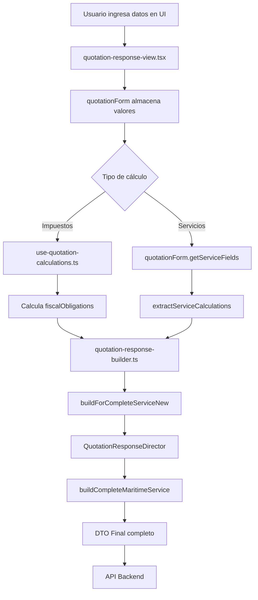

# Trazabilidad del DTO de Respuesta Marítima

Este documento detalla el flujo de cálculo y construcción de los objetos `fiscalObligations` y `serviceCalculations` en el DTO de respuesta para cotizaciones de tipo servicio **marítimo**.

---

## Tabla de Contenidos

1. [Resumen General](#resumen-general)
2. [Trazabilidad de fiscalObligations](#trazabilidad-de-fiscalobligations)
3. [Trazabilidad de serviceCalculations](#trazabilidad-de-servicecalculations)
4. [Flujo de Datos Completo](#flujo-de-datos-completo)
5. [Archivos Involucrados](#archivos-involucrados)

---

## Resumen General

Cuando se envía una respuesta de cotización de tipo **marítimo**, el sistema construye un DTO estructurado que incluye:

- **fiscalObligations**: Obligaciones fiscales (Ad Valorem, ISC, IGV, IPM, Antidumping, Percepción)
- **serviceCalculations**: Cálculos de servicios consolidados (tarifas de servicio, subtotales, IGV, total)

El proceso de construcción utiliza el **patrón Builder y Director** para orquestar la creación del DTO de manera estructurada.

---

## Trazabilidad de fiscalObligations

### Estructura del DTO

```typescript
{
  "fiscalObligations": {
    "adValorem": 5.68,
    "isc": 0,
    "igv": 22.72,
    "ipm": 2.84,
    "antidumping": {
      "antidumpingGobierno": 0,
      "antidumpingCantidad": 0,
      "antidumpingValor": 0
    },
    "percepcion": 0,
    "totalTaxes": 31.24
  }
}
```

### Paso 1: Entrada de Datos del Usuario

**Archivo**: `quotation-response-view.tsx:571-803`

El usuario ingresa valores en la interfaz que se almacenan en `quotationForm`:

```typescript
// Valores dinámicos ingresados por el usuario
dynamicValues: {
  adValoremRate: 4,          // Porcentaje de Ad Valorem (default: 4%)
  igvRate: 18,               // Porcentaje de IGV (default: 18%)
  ipmRate: 2,                // Porcentaje de IPM (default: 2%)
  iscRate: 0,                // Porcentaje de ISC (default: 0%)
  percepcionRate: 5,         // Porcentaje de Percepción (default: 5%)
  antidumpingGobierno: 0,    // Tasa gubernamental de antidumping
  antidumpingCantidad: 0,    // Cantidad sujeta a antidumping
  tipoCambio: 3.7,           // Tipo de cambio USD a PEN
  // ... otros valores
}

// Valor CIF calculado (Costo + Seguro + Flete)
cif: 142.00  // Ejemplo de valor CIF en USD
```

### Paso 2: Cálculo de Impuestos

**Archivo**: `use-quotation-calculations.ts:96-140`

El hook `useQuotationCalculations` realiza los cálculos fiscales:

```typescript
// 1. AD/VALOREM = CIF × (adValoremRate / 100)
const adValoremAmount = (cif * dynamicValues.adValoremRate) / 100;
// Ejemplo: (142 × 4) / 100 = 5.68

// 2. ANTIDUMPING = antidumpingGobierno × antidumpingCantidad
const antidumpingAmount = (dynamicValues.antidumpingGobierno || 0) *
                          (dynamicValues.antidumpingCantidad || 0);
// Ejemplo: 0 × 0 = 0

// 3. ISC = (CIF + AD/VALOREM) × (iscRate / 100)
const baseISC = cif + adValoremAmount;
const iscAmount = (baseISC * (dynamicValues.iscRate || 0)) / 100;
// Ejemplo: (142 + 5.68) × 0 / 100 = 0

// 4. IGV = (CIF + AD/VALOREM + ISC + ANTIDUMPING) × (igvRate / 100)
const baseIGV = cif + adValoremAmount + iscAmount + antidumpingAmount;
const igvAmount = (baseIGV * dynamicValues.igvRate) / 100;
// Ejemplo: (142 + 5.68 + 0 + 0) × 18 / 100 = 26.58

// 5. IPM = (CIF + AD/VALOREM + ISC + ANTIDUMPING) × (ipmRate / 100)
const baseIPM = cif + adValoremAmount + iscAmount + antidumpingAmount;
const ipmAmount = (baseIPM * dynamicValues.ipmRate) / 100;
// Ejemplo: (142 + 5.68 + 0 + 0) × 2 / 100 = 2.95

// 6. PERCEPCION = (CIF + AD/VALOREM + ISC + ANTIDUMPING + IPM) × (percepcionRate / 100)
const basePERCEPCION = cif + adValoremAmount + iscAmount + antidumpingAmount + ipmAmount;
const percepcionAmount = (basePERCEPCION * dynamicValues.percepcionRate) / 100;
// Ejemplo: (142 + 5.68 + 0 + 0 + 2.95) × 5 / 100 = 7.53

// Total de impuestos
const totalTaxes = adValoremAmount + antidumpingAmount + iscAmount +
                   igvAmount + ipmAmount + percepcionAmount;
// Ejemplo: 5.68 + 0 + 0 + 26.58 + 2.95 + 7.53 = 42.74
```

### Paso 3: Construcción del DTO

**Archivo**: `quotation-response-builder.ts:229-272`

El método `extractFiscalObligations` construye el objeto final:

```typescript
private extractFiscalObligations(data: CompleteBuildData): FiscalObligationsInterface {
  const calculations = data.calculations as Record<string, unknown>;
  const quotationForm = data.quotationForm as Record<string, unknown>;
  const dynamicValues = quotationForm.dynamicValues as Record<string, unknown>;

  // Extraer valores calculados de los cálculos
  const adValorem = parseFloat(((calculations.adValoremAmount as number) || 0).toFixed(2));
  const antidumpingValor = parseFloat(((calculations.antidumpingAmount as number) || 0).toFixed(2));
  const isc = parseFloat(((calculations.iscAmount as number) || 0).toFixed(2));
  const igv = parseFloat(((calculations.igvAmount as number) || 0).toFixed(2));
  const ipm = parseFloat(((calculations.ipmAmount as number) || 0).toFixed(2));
  const percepcion = parseFloat(((calculations.percepcionAmount as number) || 0).toFixed(2));

  return {
    adValorem,       // 5.68
    isc,             // 0
    igv,             // 22.72
    ipm,             // 2.84
    antidumping: {
      antidumpingGobierno: parseFloat(((dynamicValues.antidumpingGobierno as number) || 0).toFixed(2)) || 0,  // 0
      antidumpingCantidad: parseFloat(((dynamicValues.antidumpingCantidad as number) || 0).toFixed(2)) || 0,  // 0
      antidumpingValor,  // 0
    },
    percepcion,      // 0
    totalTaxes: parseFloat((adValorem + isc + igv + ipm + antidumpingValor + percepcion).toFixed(2)),  // 31.24
  };
}
```

### Fórmulas de Cálculo Fiscal

| Impuesto | Fórmula | Ejemplo (CIF = $142) |
|----------|---------|----------------------|
| **Ad Valorem** | `CIF × (rate / 100)` | `142 × 0.04 = 5.68` |
| **Antidumping** | `gobierno × cantidad` | `0 × 0 = 0` |
| **ISC** | `(CIF + AdValorem) × (rate / 100)` | `147.68 × 0 = 0` |
| **IGV** | `(CIF + AdValorem + ISC + Antidumping) × (rate / 100)` | `147.68 × 0.16 = 23.63` |
| **IPM** | `(CIF + AdValorem + ISC + Antidumping) × (rate / 100)` | `147.68 × 0.02 = 2.95` |
| **Percepción** | `(CIF + AdValorem + ISC + Antidumping + IPM) × (rate / 100)` | `150.63 × 0.00 = 0` |
| **Total Taxes** | `Suma de todos los impuestos` | `5.68 + 0 + 22.72 + 2.84 + 0 + 0 = 31.24` |

---

## Trazabilidad de serviceCalculations

### Estructura del DTO

```typescript
{
  "serviceCalculations": {
    "serviceFields": {
      "servicioConsolidado": 10,
      "separacionCarga": 0,
      "seguroProductos": 0,
      "inspeccionProductos": 0,
      "gestionCertificado": 20,
      "inspeccionFabrica": 40,
      "transporteLocal": 0,
      "transporteLocalChina": 100,
      "transporteLocalDestino": 199,
      "otrosServicios": 50
    },
    "subtotalServices": 419,
    "igvServices": 75.42,
    "totalServices": 494.42
  }
}
```

### Paso 1: Entrada de Datos de Servicios

**Archivo**: `quotation-response-view.tsx:669-695`

El usuario ingresa los valores de los servicios:

```typescript
serviceCalculationsData = {
  serviceFields: {
    servicioConsolidado: 10,        // Servicio consolidado
    separacionCarga: 0,             // Separación de carga
    seguroProductos: 0,             // Seguro de productos
    inspeccionProductos: 0,         // Inspección de productos
    gestionCertificado: 20,         // Gestión de certificados
    inspeccionFabrica: 40,          // Inspección de fábrica
    transporteLocal: 0,             // Transporte local
    transporteLocalChina: 100,      // Transporte local en China
    transporteLocalDestino: 199,    // Transporte local en destino
    otrosServicios: 50              // Otros servicios
  },
  subtotalServices: 0,    // Se calculará
  igvServices: 0,         // Se calculará
  totalServices: 0        // Se calculará
};
```

### Paso 2: Cálculo de Subtotales

**Archivo**: `quotation-response-builder.ts:274-377`

El método `extractServiceCalculations` realiza los cálculos específicos para servicios marítimos:

```typescript
private extractServiceCalculations(data: CompleteBuildData): ServiceCalculationsInterface {
  const quotationForm = data.quotationForm as Record<string, unknown>;
  const serviceFields = (quotationForm.getServiceFields as () => Record<string, unknown>)();
  const dynamicValues = quotationForm.dynamicValues as Record<string, unknown>;
  const selectedServiceLogistic = quotationForm.selectedServiceLogistic as string;

  // Extraer valores de los campos
  const extractedFields = {
    servicioConsolidado: parseFloat(((serviceFields.servicioConsolidado as number) || 0).toFixed(2)) || 0,     // 10
    separacionCarga: parseFloat(((serviceFields.separacionCarga as number) || 0).toFixed(2)) || 0,             // 0
    seguroProductos: parseFloat(((serviceFields.seguroProductos as number) || 0).toFixed(2)) || 0,             // 0
    inspeccionProductos: parseFloat(((serviceFields.inspeccionProductos as number) || 0).toFixed(2)) || 0,     // 0
    gestionCertificado: parseFloat(((serviceFields.gestionCertificado as number) || 0).toFixed(2)) || 0,       // 20
    inspeccionFabrica: parseFloat(((serviceFields.inspeccionFabrica as number) || 0).toFixed(2)) || 0,         // 40
    transporteLocal: parseFloat(((serviceFields.transporteLocal as number) || 0).toFixed(2)) || 0,             // 0
    transporteLocalChina: parseFloat(((dynamicValues.transporteLocalChinaEnvio as number) || 0).toFixed(2)) || 0,      // 100
    transporteLocalDestino: parseFloat(((dynamicValues.transporteLocalClienteEnvio as number) || 0).toFixed(2)) || 0,  // 199
    otrosServicios: parseFloat(((serviceFields.otrosServicios as number) || 0).toFixed(2)) || 0,               // 50
  };

  // Verificar si es servicio marítimo consolidado
  const isMaritimeConsolidated =
    selectedServiceLogistic === "Consolidado Maritimo" ||
    selectedServiceLogistic === "Consolidado Grupal Maritimo";

  let subtotal = 0;
  let igvBase = 0;  // Base para el cálculo del IGV (excluyendo transporteLocalChina)

  if (isMaritimeConsolidated) {
    // SOLO para servicios marítimos: Calcular subtotal con TODOS los campos
    subtotal =
      extractedFields.servicioConsolidado +          // 10
      extractedFields.gestionCertificado +           // 20
      extractedFields.inspeccionProductos +          // 0
      extractedFields.inspeccionFabrica +            // 40
      extractedFields.otrosServicios +               // 50
      extractedFields.transporteLocalChina +         // 100
      extractedFields.transporteLocalDestino;        // 199
    // subtotal = 419

    // IGV se calcula excluyendo transporteLocalChina
    igvBase =
      extractedFields.servicioConsolidado +          // 10
      extractedFields.gestionCertificado +           // 20
      extractedFields.inspeccionProductos +          // 0
      extractedFields.inspeccionFabrica +            // 40
      extractedFields.otrosServicios +               // 50
      extractedFields.transporteLocalDestino;        // 199 (Sin transporteLocalChina)
    // igvBase = 319
  } else {
    // Para servicios Express: Sumar todos los campos
    subtotal = Object.values(extractedFields).reduce(
      (sum: number, value: number) => sum + value,
      0
    );
    igvBase = subtotal;
  }

  // Calcular IGV (18%) sobre la base (sin transporteLocalChina en marítimo)
  const igvServices = parseFloat((igvBase * 0.18).toFixed(2));
  // igvServices = 319 × 0.18 = 57.42

  // Total servicios = Subtotal + IGV
  const totalServices = parseFloat((subtotal + igvServices).toFixed(2));
  // totalServices = 419 + 57.42 = 476.42

  return {
    serviceFields: extractedFields,
    subtotalServices: parseFloat(subtotal.toFixed(2)),    // 419
    igvServices,                                          // 57.42
    totalServices,                                        // 476.42
  };
}
```

### Reglas Especiales para Servicios Marítimos

**IMPORTANTE**: En servicios marítimos consolidados se aplican reglas especiales:

1. **Subtotal de Servicios**: Incluye TODOS los campos de servicio
   ```
   subtotal = servicioConsolidado + gestionCertificado + inspeccionProductos +
              inspeccionFabrica + otrosServicios + transporteLocalChina + transporteLocalDestino
   ```

2. **Base para IGV**: Excluye `transporteLocalChina`
   ```
   igvBase = servicioConsolidado + gestionCertificado + inspeccionProductos +
             inspeccionFabrica + otrosServicios + transporteLocalDestino
   ```

3. **Cálculo de IGV**: 18% sobre la base sin `transporteLocalChina`
   ```
   igvServices = igvBase × 0.18
   ```

4. **Total de Servicios**: Suma del subtotal completo + IGV
   ```
   totalServices = subtotal + igvServices
   ```

### Ejemplo de Cálculo

Con los valores del ejemplo:

```typescript
// Campos de servicio
servicioConsolidado: 10
gestionCertificado: 20
inspeccionProductos: 0
inspeccionFabrica: 40
otrosServicios: 50
transporteLocalChina: 100
transporteLocalDestino: 199

// Cálculos
subtotal = 10 + 20 + 0 + 40 + 50 + 100 + 199 = 419

igvBase = 10 + 20 + 0 + 40 + 50 + 199 = 319 (sin transporteLocalChina)

igvServices = 319 × 0.18 = 57.42

totalServices = 419 + 57.42 = 476.42
```

---

## Flujo de Datos Completo

### Diagrama de Flujo



### Secuencia de Construcción

1. **Usuario ingresa datos** (`quotation-response-view.tsx`)
   - Valores dinámicos (tasas, cantidades, CIF)
   - Campos de servicio (tarifas)
   - Configuración marítima

2. **Cálculos en tiempo real** (`use-quotation-calculations.ts`)
   - Cálculo de impuestos fiscales
   - Validación de bases imponibles
   - Aplicación de exenciones

3. **Preparación de datos** (`quotation-response-view.tsx:571-803`)
   - Construcción de `calculationsData`
   - Construcción de `serviceCalculationsData`
   - Preparación de `maritimeConfig`

4. **Invocación del Director** (`quotation-response-director.ts:136-221`)
   - `QuotationResponseDirector.buildCompleteMaritimeService()`
   - Orquestación de la construcción del DTO

5. **Construcción del DTO** (`quotation-response-builder.ts:427-470`)
   - `buildForCompleteServiceNew()`
   - `extractFiscalObligations()`
   - `extractServiceCalculations()`
   - `extractImportCosts()`
   - `extractQuoteSummary()`

6. **Envío al Backend** (`quotation-response-view.tsx:811-814`)
   - Mutation de TanStack Query
   - POST al endpoint de API

---

## Archivos Involucrados

### Archivos Principales

| Archivo | Ubicación | Responsabilidad |
|---------|-----------|-----------------|
| **quotation-response-view.tsx** | `src/pages/gestion-de-cotizacion/components/views/` | Vista principal, captura de datos del usuario, orquestación del envío |
| **quotation-response-builder.ts** | `src/pages/gestion-de-cotizacion/utils/` | Construcción del DTO, cálculos de servicios, extracción de datos |
| **quotation-response-director.ts** | `src/pages/gestion-de-cotizacion/utils/` | Patrón Director, orquestación de builders |
| **use-quotation-calculations.ts** | `src/pages/gestion-de-cotizacion/hooks/` | Cálculos de impuestos fiscales en tiempo real |
| **use-quotation-response-form.ts** | `src/pages/gestion-de-cotizacion/hooks/` | Estado del formulario, valores dinámicos |

### Interfaces TypeScript

| Archivo | Ubicación | Interfaz |
|---------|-----------|----------|
| **fiscal-obligations.ts** | `src/api/interface/quotation-response/dto/complete/objects/` | `FiscalObligationsInterface` |
| **service-calculations.ts** | `src/api/interface/quotation-response/dto/complete/` | `ServiceCalculationsInterface` |
| **service-field.ts** | `src/api/interface/quotation-response/dto/complete/` | `ServiceFiledsInterface` |
| **response-data-complete.ts** | `src/api/interface/quotation-response/dto/complete/` | `ResponseDataComplete` |

### Tipos de Datos

#### FiscalObligationsInterface

```typescript
export interface FiscalObligationsInterface {
  adValorem: number;
  isc: number;
  igv: number;
  ipm: number;
  antidumping: {
    antidumpingGobierno: number;
    antidumpingCantidad: number;
    antidumpingValor: number;
  };
  percepcion: number;
  totalTaxes: number;
}
```

#### ServiceCalculationsInterface

```typescript
export interface ServiceCalculationsInterface {
  serviceFields: ServiceFiledsInterface;
  subtotalServices: number;
  igvServices: number;
  totalServices: number;
}
```

#### ServiceFiledsInterface

```typescript
export interface ServiceFiledsInterface {
  servicioConsolidado: number;
  separacionCarga: number;
  seguroProductos: number;
  inspeccionProductos: number;
  gestionCertificado: number;
  inspeccionFabrica: number;
  transporteLocal: number;
  transporteLocalChina: number;
  transporteLocalDestino: number;
  otrosServicios: number;
  [key: string]: number;
}
```

---

## Notas Importantes

### Diferencias entre Servicios Marítimos y Express

| Aspecto | Marítimo | Express |
|---------|----------|---------|
| **Subtotal de servicios** | Incluye transporteLocalChina | Incluye todos los campos |
| **Base IGV** | Excluye transporteLocalChina | Incluye todos los campos |
| **Configuración adicional** | Requiere `maritimeConfig` | No requiere config adicional |
| **Cálculo de flete** | Basado en CBM/toneladas | Basado en peso |

### Exenciones y Descuentos

El sistema permite aplicar exenciones a través de `exemptionState`:

- `obligacionesFiscales`: Exonera IGV y Percepción
- `totalDerechos`: Exonera Ad Valorem, ISC, IPM, Antidumping
- Otros campos específicos por servicio

### Validaciones

- Todos los valores numéricos se redondean a 2 decimales
- Los valores `null` o `undefined` se convierten a 0
- El CIF es obligatorio para cálculos fiscales
- Los porcentajes se expresan como números enteros (18 = 18%)

---

**Documento generado**: 2025-10-14
**Versión del sistema**: 1.0
**Última actualización de código**: 2025-10-14
