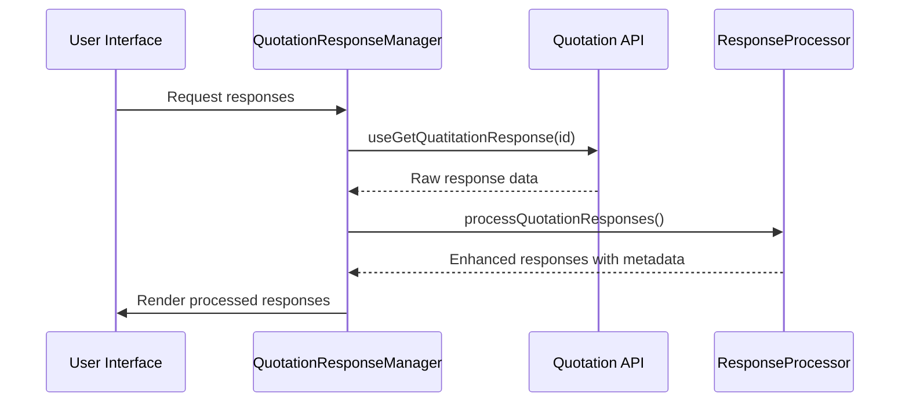
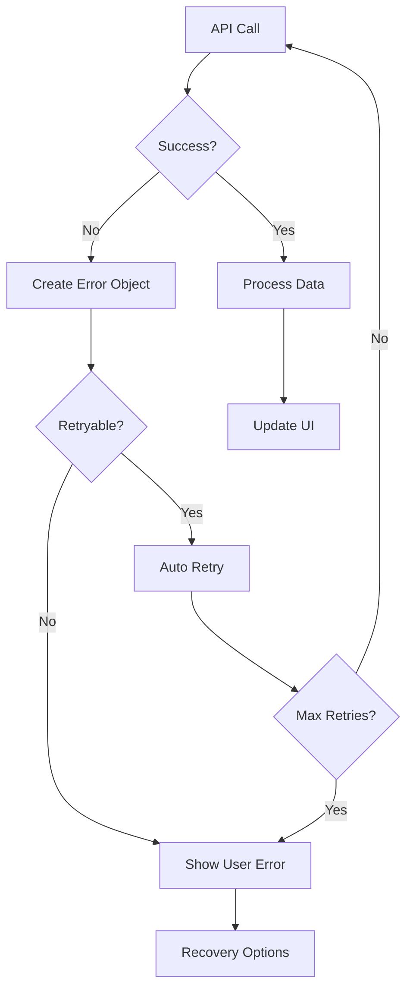

# Quotation Response Management System

## Overview

This is a comprehensive refactoring of the quotation response components that addresses critical filtering logic issues, responsive design problems, and code organization improvements. The new architecture provides enhanced user experience with improved mobile support, better error handling, and maintainable code structure.

## Architecture

### Component Hierarchy

```
QuotationResponseManager (Main Orchestrator)
├── ResponseDisplayContainer (Layout Management)
│   ├── ResponseFilters (Advanced Filtering)
│   ├── TabNavigation (Dynamic Tabs)
│   └── TabContent (Content Renderer)
│       ├── PendingResponseView (Mobile-Optimized)
│       │   ├── ResponsiveProductTable
│       │   └── MobileProductCard
│       └── CompletedResponseView (Analysis & Calculations)
├── AdminQuotationResponseManager (Admin Wrapper)
└── QuotationResponseViewer (User Wrapper)
```

### Key Features

#### 🔍 Enhanced Filtering System
- **Multi-criteria filtering**: Service type, response ID, date range, status
- **Real-time application**: Immediate filter application without page reload
- **Unique identification**: Solves the original filtering logic issues with proper serviceType + responseId combination
- **Filter persistence**: Maintains filter state across component updates

#### 📱 Mobile-First Responsive Design
- **Progressive disclosure**: Automatic column collapsing on smaller screens
- **Touch-friendly interactions**: Large touch targets and swipe gestures
- **Horizontal scroll handling**: Smooth scrolling for wide content
- **Card-based layouts**: Mobile-optimized product cards with expandable details

#### 🎯 Advanced Error Handling
- **Comprehensive error boundaries**: Graceful error recovery
- **User-friendly messages**: Clear, actionable error communication
- **Retry mechanisms**: Automatic retry with exponential backoff
- **Error recovery strategies**: Context-aware recovery suggestions

#### ⚡ Performance Optimizations
- **Lazy loading**: Code splitting for better performance
- **Memoization**: Efficient re-rendering with React.memo and useMemo
- **Progressive loading**: Multi-step loading with progress indicators
- **Debounced operations**: Smooth user interactions without lag

## Component Guide

### QuotationResponseManager

The main orchestrator component that handles:
- Data fetching and processing
- State management
- Error handling
- Child component coordination

```tsx
<QuotationResponseManager
  quotationId="12345"
  mode="admin" // or "user"
  onResponseUpdate={(response) => console.log('Updated:', response)}
  onError={(error) => console.error('Error:', error)}
  readonly={false}
/>
```

### PendingResponseView

Specialized component for "Pendiente" service types with:
- Mobile-optimized grid layout
- Expandable product cards
- Multiple view modes (grid, table, summary)
- Progressive disclosure of details

### CompletedResponseView

Advanced view for processed responses featuring:
- Cost breakdown analysis
- Interactive calculation displays
- Export functionality
- Summary visualizations

### ResponsiveProductTable

Adaptive table component that:
- Automatically adjusts columns based on screen size
- Provides mobile card fallback
- Supports admin editing capabilities
- Handles large datasets efficiently

## Usage Examples

### Basic Implementation (User View)

```tsx
import QuotationResponseViewer from './components/quotation-responses/QuotationResponseViewer';

function UserQuotationPage() {
  const { quotationId } = useParams();
  
  return (
    <QuotationResponseViewer
      quotationId={quotationId}
      readonly={true}
    />
  );
}
```

### Advanced Implementation (Admin View)

```tsx
import AdminQuotationResponseManager from './components/quotation-response/AdminQuotationResponseManager';

function AdminResponsePage() {
  const { quotationId } = useParams();
  
  const handleResponseUpdate = (response) => {
    // Handle response updates
    toast.success('Response updated successfully');
  };
  
  return (
    <AdminQuotationResponseManager
      quotationId={quotationId}
      quotationData={quotationDetails}
      onResponseUpdate={handleResponseUpdate}
      readonly={false}
    />
  );
}
```

### Custom Filtering

```tsx
import { ResponseFilters } from './components/quotation-response/filters/ResponseFilters';

function CustomFilterExample() {
  const [filters, setFilters] = useState({
    serviceType: 'Pendiente',
    dateRange: {
      start: new Date('2024-01-01'),
      end: new Date('2024-12-31'),
    }
  });

  return (
    <ResponseFilters
      responses={responses}
      filters={filters}
      onFiltersChange={setFilters}
    />
  );
}
```

## API Integration

### Data Processing Flow



### Error Handling Flow



## Testing

### Unit Tests
- **Response Processing**: Filtering, grouping, unique ID generation
- **Error Handling**: Error creation, retry logic, recovery strategies
- **Calculations**: Cost calculations, metadata generation
- **Utilities**: Formatters, validators, helpers

### Integration Tests
- **Component Integration**: Parent-child component communication
- **API Compatibility**: Hook integration and data flow
- **User Interactions**: Click, form submission, navigation
- **Responsive Behavior**: Screen size adaptations

### Running Tests

```bash
# Run all tests
npm test

# Run specific test suites
npm test -- --testNamePattern="Response Processing"
npm test -- --testNamePattern="Error Handling"

# Run with coverage
npm test -- --coverage
```

## Migration Guide

### From Legacy respuestas-cotizacion-view.tsx

The old component has been completely refactored. Key changes:

1. **Simplified Structure**: Complex state management replaced with clean architecture
2. **Enhanced Filtering**: Old tab-based filtering replaced with advanced multi-criteria filtering
3. **Mobile Support**: Added comprehensive responsive design
4. **Error Handling**: Improved error boundaries and user feedback

### Breaking Changes

- `selectedResponseTab` state removed (now handled internally)
- `productsList` calculation moved to utilities
- Modal management simplified
- Tab switching logic enhanced

### Migration Steps

1. Replace import:
   ```tsx
   // Old
   import RespuestasCotizacionView from './respuestas-cotizacion-view';
   
   // New
   import QuotationResponseViewer from './components/quotation-responses/QuotationResponseViewer';
   ```

2. Update props:
   ```tsx
   // Old
   <RespuestasCotizacionView selectedQuotationId={id} />
   
   // New
   <QuotationResponseViewer quotationId={id} readonly={true} />
   ```

## Performance Considerations

### Optimization Strategies

1. **Lazy Loading**: Components are loaded on-demand
2. **Memoization**: Heavy calculations are memoized
3. **Virtual Scrolling**: Large lists use virtual scrolling
4. **Debounced Filters**: Filter changes are debounced
5. **Progressive Loading**: Multi-step loading for better UX

### Memory Management

- Component cleanup on unmount
- Event listener removal
- Cache invalidation strategies
- Efficient re-rendering patterns

## Browser Support

- **Modern Browsers**: Chrome 80+, Firefox 75+, Safari 13+, Edge 80+
- **Mobile Browsers**: iOS Safari 13+, Chrome Mobile 80+
- **Progressive Enhancement**: Graceful degradation for older browsers

## Accessibility

- **ARIA Labels**: Comprehensive screen reader support
- **Keyboard Navigation**: Full keyboard accessibility
- **Focus Management**: Proper focus trapping and management
- **Color Contrast**: WCAG 2.1 AA compliance
- **Mobile Accessibility**: Touch target sizing and spacing

## Contributing

### Development Setup

1. Install dependencies:
   ```bash
   npm install
   ```

2. Start development server:
   ```bash
   npm run dev
   ```

3. Run tests:
   ```bash
   npm test
   ```

### Code Style

- **TypeScript**: Strict mode enabled
- **ESLint**: Airbnb configuration with React hooks
- **Prettier**: Consistent code formatting
- **Naming**: Descriptive names with clear intent

### Adding New Features

1. Create feature branch from main
2. Implement changes with tests
3. Update documentation
4. Submit pull request with description

## Troubleshooting

### Common Issues

#### Filter Not Working
- Check unique ID generation in `responseProcessing.ts`
- Verify filter criteria in `ResponseFilters.tsx`
- Ensure API data structure matches interfaces

#### Mobile Layout Issues
- Verify responsive breakpoints in CSS
- Check mobile detection in `useMobile` hook
- Test on actual devices, not just browser dev tools

#### Performance Problems
- Enable React DevTools Profiler
- Check for unnecessary re-renders
- Verify memoization is working correctly

### Debug Mode

Enable debug mode by setting environment variable:
```bash
NODE_ENV=development
```

This enables:
- Detailed console logging
- Component debug information
- Development-only UI controls

## License

This project is licensed under the MIT License - see the LICENSE file for details.